# California Puzzle Game - Architecture Diagrams

**Document Version**: 1.0
**Last Updated**: December 10, 2025
**Purpose**: Visual architecture documentation for portfolio presentation

---

## Table of Contents

1. [System Overview](#system-overview)
2. [Domain Store Architecture](#domain-store-architecture)
3. [Event Flow Diagram](#event-flow-diagram)
4. [Component Hierarchy](#component-hierarchy)
5. [Data Flow](#data-flow)
6. [Before/After Refactoring](#beforeafter-refactoring)

---

## System Overview

### High-Level Architecture

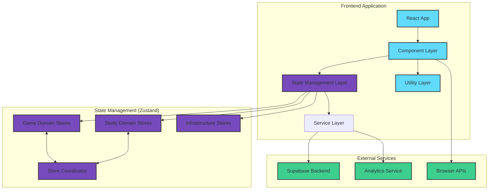

---

## Domain Store Architecture

### Game Domain Decomposition

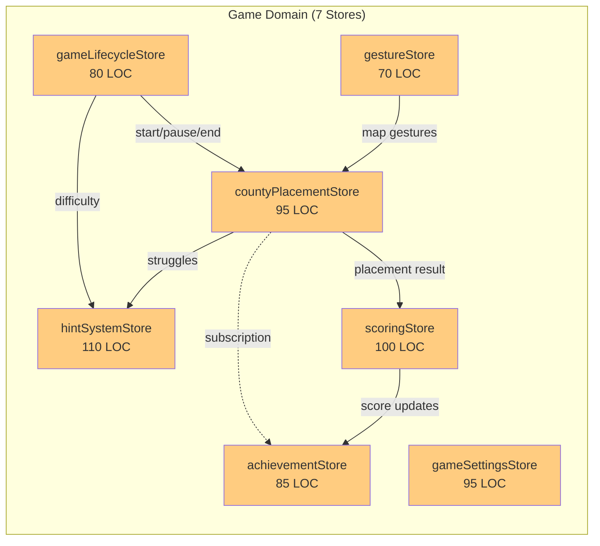

### Study Domain Decomposition

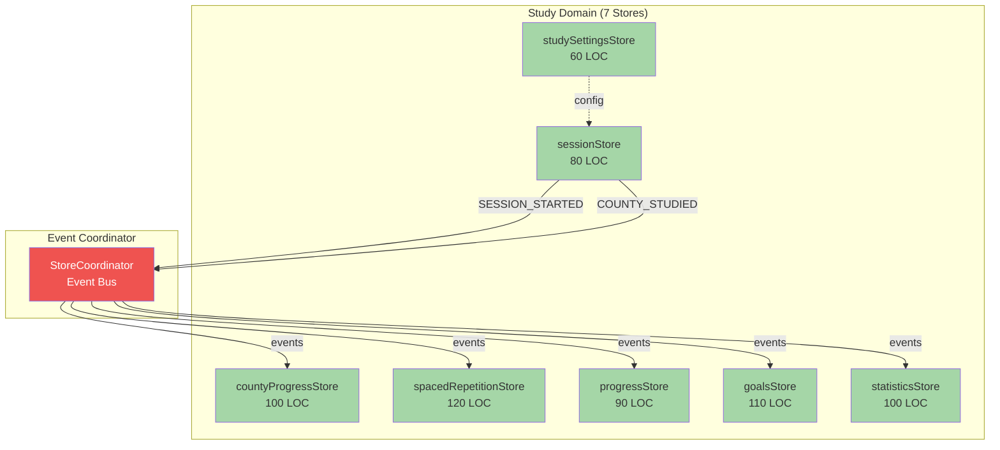

---

## Event Flow Diagram

### Study Domain Event Coordination

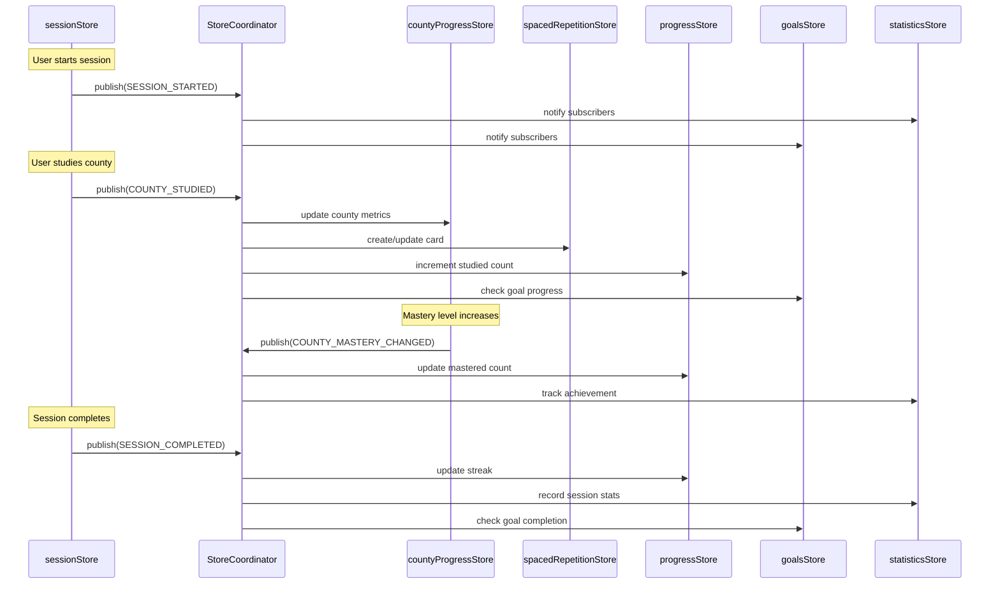

### Cross-Store Subscription Pattern

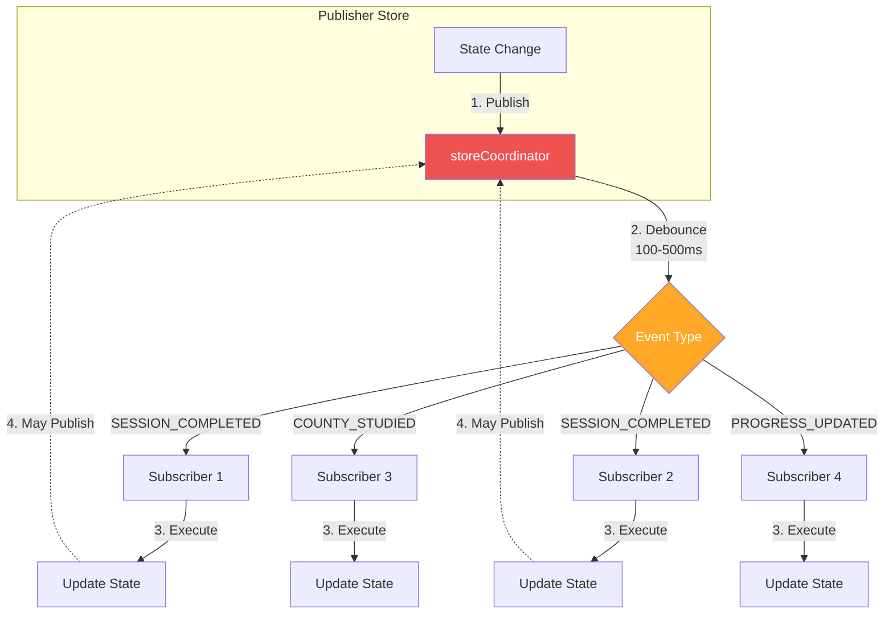

---

## Component Hierarchy

### Application Structure

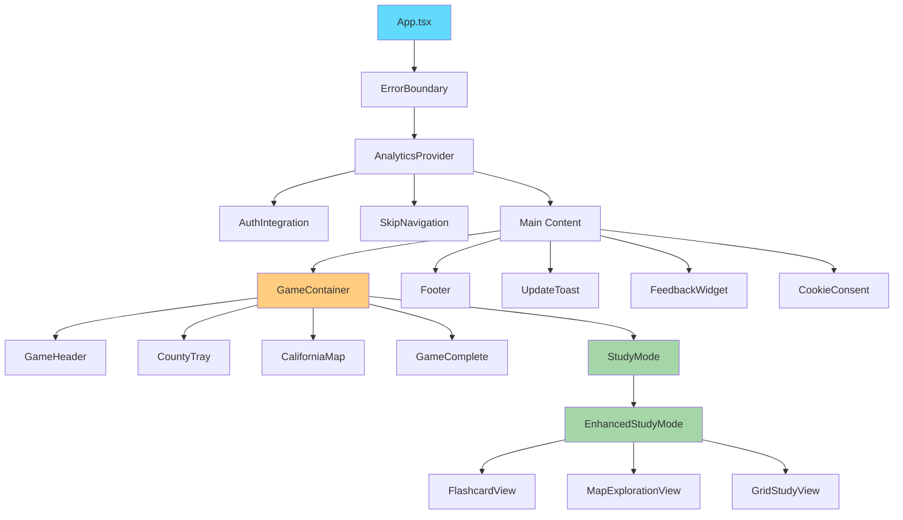

### Component-Store Dependencies

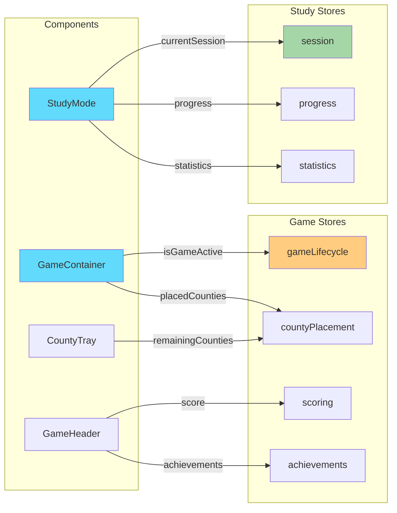

---

## Data Flow

### Game Mode Data Flow

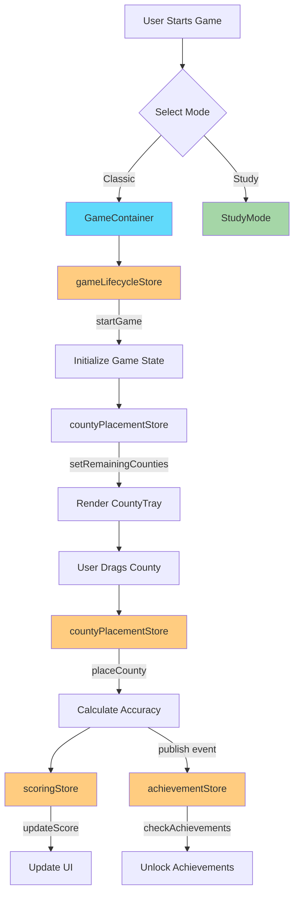

### Study Mode Data Flow

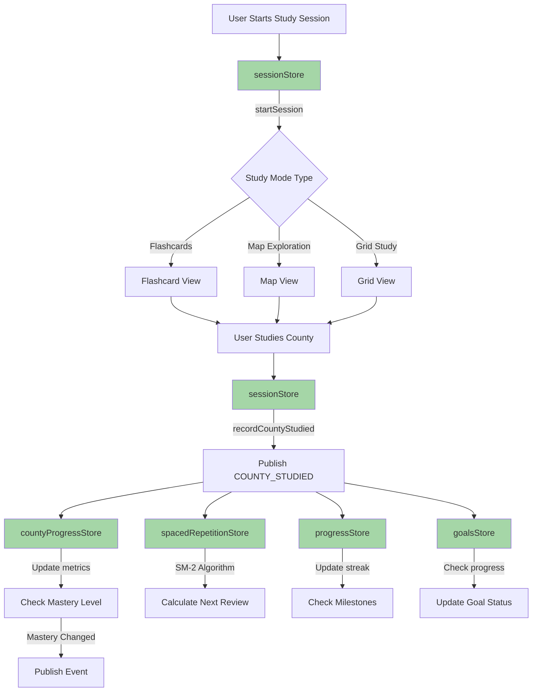

---

## Before/After Refactoring

### Before: Monolithic Architecture

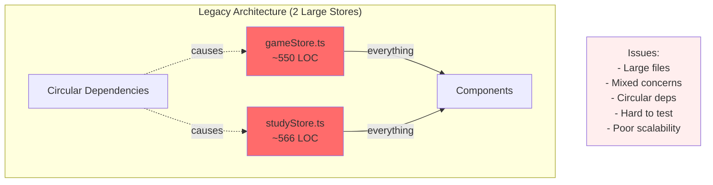

### After: Domain-Driven Architecture

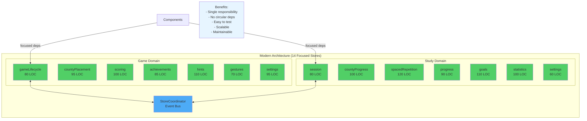

### Metrics Comparison

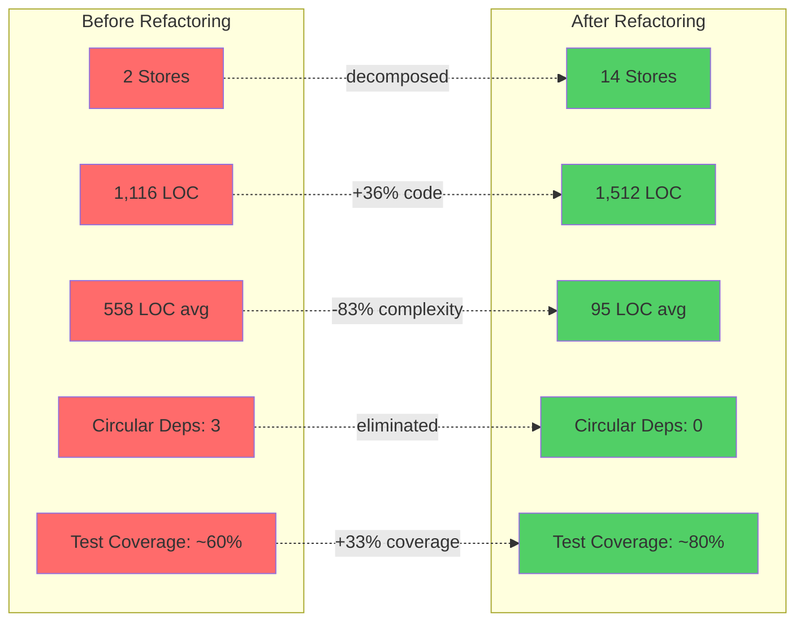

---

## Technology Stack Visualization

```mermaid
graph TB
    subgraph "Frontend Stack"
        A[React 18]
        B[TypeScript 5.9]
        C[Vite 4.5]
        D[Tailwind CSS 3.4]
    end

    subgraph "State Management"
        E[Zustand 4.4]
        F[Custom Event Coordinator]
    end

    subgraph "UI/UX Libraries"
        G[D3.js 7.8.5]
        H[@dnd-kit 6.3.1]
        I[Framer Motion 10.16]
    end

    subgraph "Testing"
        J[Vitest 2.0]
        K[Testing Library 16.0]
        L[jest-axe 10.0]
        M[Playwright]
    end

    subgraph "Backend Services"
        N[Supabase 2.75]
        O[PostgreSQL]
        P[Auth Service]
    end

    A --> E
    B --> E
    C --> A
    D --> A
    E --> F
    A --> G
    A --> H
    A --> I
    A --> J
    J --> K
    J --> L
    A --> N
    N --> O
    N --> P

    style E fill:#764abc,color:#fff
    style F fill:#ef5350,color:#fff
    style J fill:#6b9a61
    style N fill:#3ecf8e
```

---

## Deployment Architecture

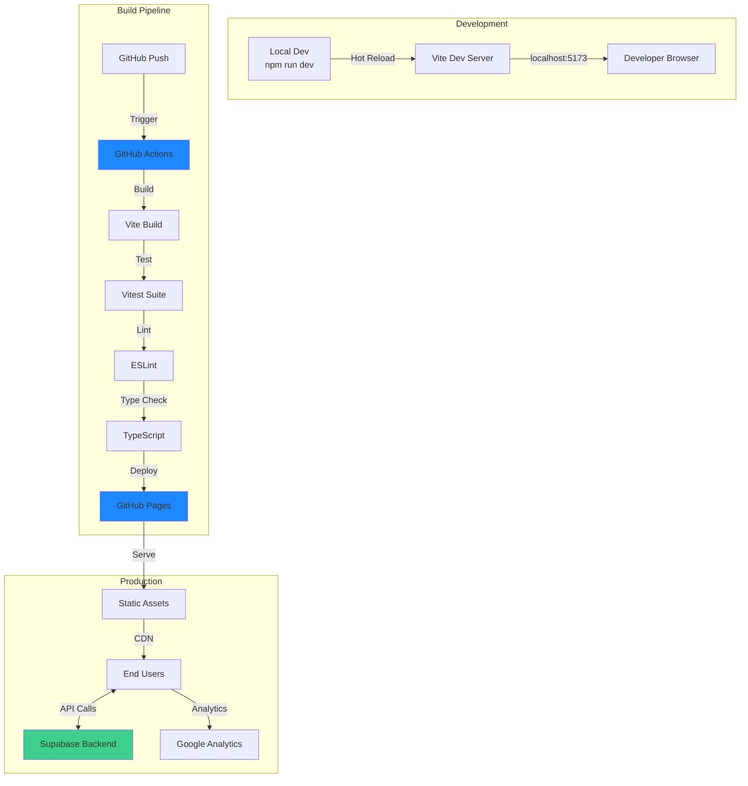

---

## Performance Optimization Strategy

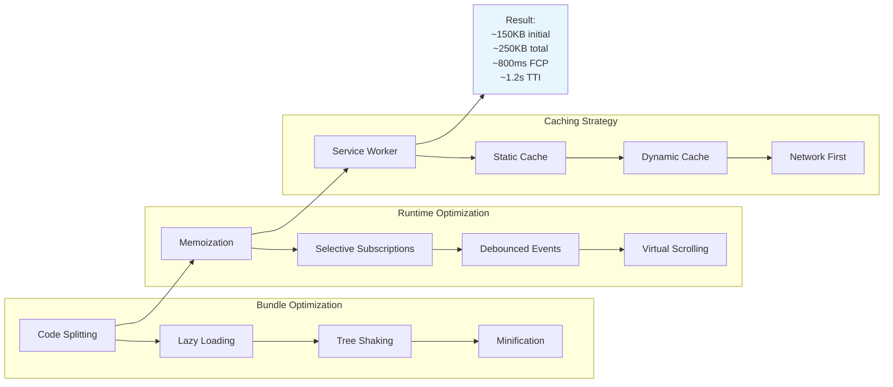

---

## Security Architecture

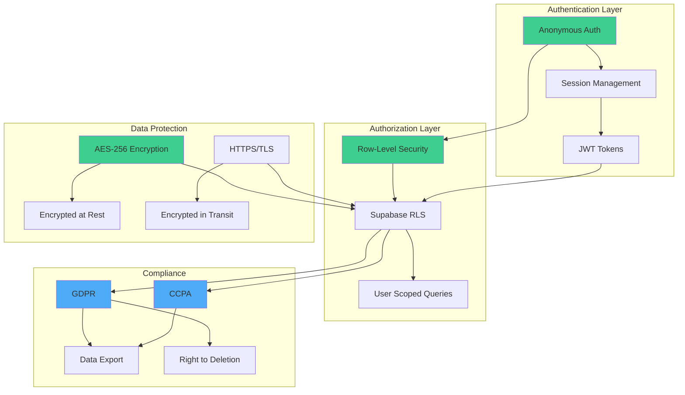

---

## Mobile Architecture

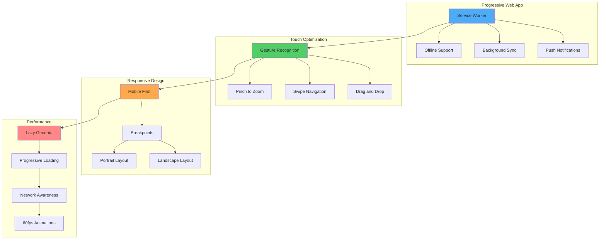

---

## Conclusion

These architecture diagrams provide a comprehensive visual representation of the California Puzzle Game's technical design. The diagrams demonstrate:

1. **Well-Structured Domain Decomposition** - Clear separation of game and study concerns
2. **Event-Driven Coordination** - Decoupled stores communicating via typed events
3. **Modern Tech Stack** - Industry-standard tools and libraries
4. **Scalable Architecture** - Easy to extend without modifying existing code
5. **Production-Ready** - Security, performance, and accessibility built-in

### Usage

These diagrams are rendered using Mermaid syntax and can be viewed in:

- GitHub (native Mermaid support)
- VS Code (Mermaid Preview extension)
- Online Mermaid editors
- Portfolio websites (Mermaid.js integration)

### For Portfolio Presentation

Export these diagrams as:

- **PNG/SVG** - For static documentation
- **Interactive HTML** - For portfolio website
- **PDF** - For printable architecture documentation

---

**Document Maintained By**: System Architecture Designer
**Last Updated**: December 10, 2025
**Related Docs**: `PORTFOLIO_ARCHITECTURE_ASSESSMENT.md`, `STUDY_DOMAIN_STORE_ARCHITECTURE.md`
