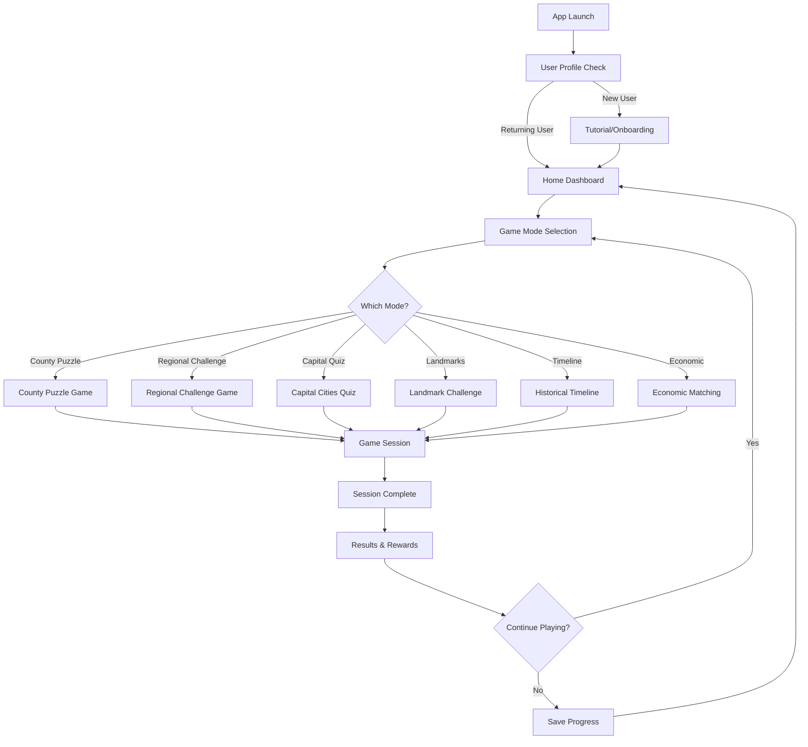
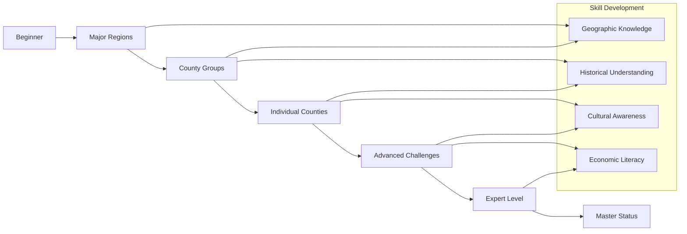
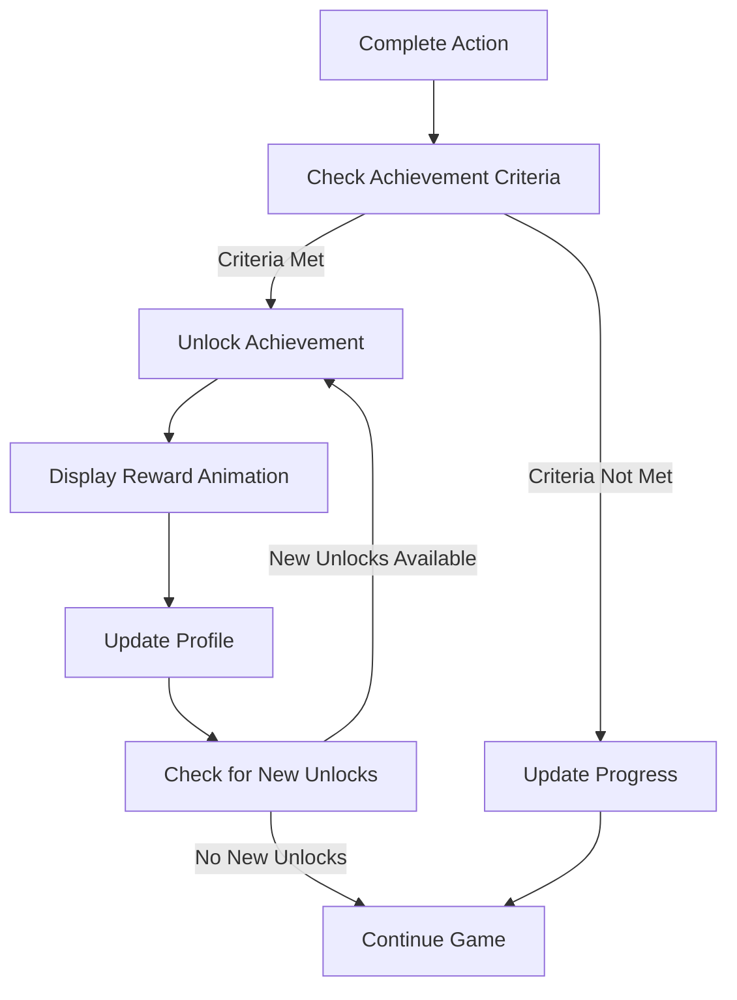

# California Puzzle Game - Comprehensive Game Design Document

## Table of Contents
1. [Game Overview](#game-overview)
2. [Game Modes](#game-modes)
3. [Difficulty Progression System](#difficulty-progression-system)
4. [California-Themed Rewards System](#california-themed-rewards-system)
5. [Educational Content Framework](#educational-content-framework)
6. [User Interface Design](#user-interface-design)
7. [Game Flow Diagrams](#game-flow-diagrams)
8. [Technical Architecture](#technical-architecture)
9. [Data Integration](#data-integration)
10. [Performance & Analytics](#performance--analytics)

---

## Game Overview

### Core Concept
An interactive educational puzzle game that teaches players about California's geography, history, culture, and economy through engaging gameplay mechanics. The game combines spatial reasoning, knowledge acquisition, and progressive challenges to create an immersive learning experience about the Golden State.

### Target Audience
- **Primary**: Students aged 10-18 (middle school to high school)
- **Secondary**: Adult learners, tourists, and California residents
- **Tertiary**: Geography enthusiasts and educators

### Learning Objectives
- Master California's county geography and boundaries
- Understand regional divisions and characteristics
- Learn about historical events and timeline
- Explore economic activities and industries
- Discover landmarks and cultural sites
- Appreciate California's diversity and environmental features

---

## Game Modes

### 1. County Puzzle Mode
**Core Mechanic**: Drag-and-drop county shapes to correct positions on the California map

#### Gameplay Features:
- **Visual Feedback**: Counties snap into place with satisfying animations
- **Hint System**:
  - Border highlighting for adjacent counties
  - Shape rotation assistance
  - Size comparison guides
- **Progressive Revelation**: Map background becomes clearer as more counties are placed
- **Error Handling**: Gentle corrections with educational tooltips

#### Variations:
- **Classic Mode**: All 58 counties at once
- **Regional Focus**: Complete one region at a time
- **Time Attack**: Speed placement challenges
- **Blind Mode**: No background map reference

### 2. Regional Challenge
**Core Mechanic**: Group counties into California's recognized regions

#### Regional Divisions:
1. **Northern California** (Bay Area, Wine Country, Redwood Coast)
2. **Central Valley** (Sacramento Valley, San Joaquin Valley)
3. **Central Coast** (Monterey Bay to San Luis Obispo)
4. **Southern California** (Los Angeles, Orange County, Inland Empire)
5. **Desert Regions** (Mojave, Colorado Desert)
6. **Sierra Nevada** (Lake Tahoe, Yosemite region)
7. **Far North** (Shasta Cascade region)

#### Gameplay Elements:
- **Color Coding**: Visual organization system
- **Drag-and-Sort**: Move counties between regional bins
- **Validation**: Real-time feedback on correct groupings
- **Educational Pop-ups**: Learn why counties belong to specific regions

### 3. Capital Cities Quiz
**Core Mechanic**: Match county seats with their corresponding counties

#### Challenge Types:
- **Multiple Choice**: Select from 4 options
- **Direct Placement**: Click on the correct county
- **Speed Round**: Rapid-fire capital identification
- **Picture Clues**: Identify capitals from landmark photos

#### Knowledge Areas:
- County seats and administrative centers
- Historical significance of capital selection
- Population and economic importance
- Geographic advantages of location

### 4. Landmark Location Challenge
**Core Mechanic**: Place famous California landmarks on the correct counties

#### Featured Landmarks:
- **Natural**: Yosemite Falls, Death Valley, Lake Tahoe, Big Sur
- **Man-made**: Golden Gate Bridge, Hollywood Sign, Disneyland
- **Historical**: Alcatraz, Mission San Juan Capistrano, Sutter's Mill
- **Cultural**: Getty Center, Silicon Valley, Napa Valley

#### Gameplay Features:
- **Photo Recognition**: Match landmark images to locations
- **Zoom Functionality**: Detailed county-level placement
- **Information Cards**: Learn about each landmark's significance
- **Virtual Tours**: 360° views of major landmarks

### 5. Historical Timeline Mode
**Core Mechanic**: Arrange historical events on both temporal and spatial axes

#### Timeline Periods:
1. **Pre-Colonial Era** (Indigenous peoples, 1000+ years)
2. **Spanish Period** (1769-1821)
3. **Mexican Period** (1821-1848)
4. **Early Statehood** (1848-1900)
5. **Modern California** (1900-present)

#### Interactive Elements:
- **Event Cards**: Drag events to correct time periods and locations
- **Cause and Effect**: Connect related historical events
- **Timeline Slider**: Explore different eras
- **Character Stories**: Follow historical figures through time

### 6. Economic Activity Matching
**Core Mechanic**: Match industries and economic activities to their primary counties

#### Economic Sectors:
- **Agriculture**: Central Valley farming, wine production
- **Technology**: Silicon Valley, biotech
- **Entertainment**: Hollywood, theme parks
- **Tourism**: National parks, beaches
- **Energy**: Oil production, renewable energy
- **Aerospace**: Defense contractors, space industry
- **Shipping**: Port activities, logistics

#### Challenge Types:
- **Resource Mapping**: Where specific crops/products are grown/made
- **Industry Clusters**: Identify technology and business hubs
- **Trade Routes**: Connect ports to inland destinations
- **Economic Impact**: Understand county-level economic contributions

---

## Difficulty Progression System

### Level Structure

#### Beginner (Levels 1-10)
- **Focus**: Major regions and largest counties
- **Counties**: 8-12 largest counties (Los Angeles, San Diego, Orange, etc.)
- **Assistance**: High hint availability, forgiving timing
- **Rewards**: Basic California facts, simple achievements

#### Intermediate (Levels 11-25)
- **Focus**: Complete regional groupings
- **Counties**: 20-35 counties grouped by regions
- **Assistance**: Moderate hints, time pressure introduction
- **Rewards**: Regional expertise badges, historical facts

#### Advanced (Levels 26-40)
- **Focus**: All 58 counties with detailed knowledge
- **Counties**: Complete state coverage
- **Assistance**: Limited hints, accuracy requirements
- **Rewards**: County expert status, detailed statistics

#### Expert (Levels 41-50)
- **Focus**: Speed challenges and complex scenarios
- **Counties**: All counties with time constraints and trivia
- **Assistance**: Minimal guidance, precision required
- **Rewards**: Golden State master status, leaderboard access

#### Master (Levels 51+)
- **Focus**: Custom challenges and community content
- **Counties**: Player-created scenarios and competitions
- **Assistance**: No hints, competitive environment
- **Rewards**: Exclusive achievements, educator status

### Adaptive Difficulty
- **Performance Tracking**: Monitor success rates and completion times
- **Dynamic Adjustment**: Increase/decrease difficulty based on player performance
- **Personalized Learning**: Recommend specific game modes based on strengths/weaknesses
- **Accessibility Options**: Colorblind-friendly palettes, motor accessibility features

---

## California-Themed Rewards System

### Achievement Categories

#### 1. Golden State Badges
**Tier System**: Bronze, Silver, Gold, Platinum

**Regional Mastery Badges**:
- **Bay Area Expert**: Master all 9 Bay Area counties
- **Valley Champion**: Complete Central Valley challenges
- **Desert Navigator**: Conquer desert region puzzles
- **Coastal Cruiser**: Excel in coastal county games
- **Mountain Master**: Dominate Sierra Nevada challenges
- **Border Boss**: Perfect border county identification

**Skill-Based Badges**:
- **Speed Demon**: Complete puzzles under time limits
- **Perfectionist**: Achieve 100% accuracy streaks
- **Knowledge Keeper**: Score high on trivia questions
- **Explorer**: Discover all landmark locations

#### 2. Bear Republic Achievements
**California State Symbol Integration**

**The Golden Bear Collection**:
- **Cub Scout**: Complete first 5 levels
- **Bear Tracker**: Master 20 counties
- **Alpha Bear**: Achieve expert status
- **Legendary Grizzly**: Unlock all content

**State Symbol Achievements**:
- **Golden Poppy**: Complete all flower-related challenges
- **Redwood Giant**: Master northern California
- **California Condor**: Achieve rare perfect scores
- **Blue Whale**: Complete ocean-related content

#### 3. Tech Innovation Awards
**Silicon Valley Inspired Rewards**

**Innovation Badges**:
- **Startup Founder**: Create custom game mode
- **Tech Disruptor**: Discover optimal strategies
- **Digital Pioneer**: Use all game features
- **Algorithm Master**: Achieve consistent high performance

**Patent Achievements**:
- **Geography Patent**: Invent new learning method
- **Speed Patent**: Develop time-saving techniques
- **Accuracy Patent**: Maintain perfect streaks

#### 4. Hollywood Stars System
**Entertainment Industry Theme**

**Star Ratings**: ⭐ to ⭐⭐⭐⭐⭐ for each county mastered

**Celebrity Status Levels**:
- **Extra**: Beginning player (0-100 stars)
- **Supporting Actor**: Intermediate (101-250 stars)
- **Lead Actor**: Advanced (251-400 stars)
- **Director**: Expert (401-500 stars)
- **Producer**: Master (500+ stars)

**Walk of Fame**: Permanent record of achievements with personalized star

### Reward Mechanics
- **Daily Challenges**: Rotating themed puzzles with special rewards
- **Seasonal Events**: California-themed challenges (Gold Rush, Tech Boom, etc.)
- **Leaderboards**: County-by-county and overall rankings
- **Social Sharing**: Achievement sharing with custom graphics
- **Progress Tracking**: Visual progress maps and statistics

---

## Educational Content Framework

### County-Specific Information

#### Data Categories for Each County:
1. **Basic Information**
   - County seat and major cities
   - Population and area statistics
   - Date of establishment
   - Name origin and meaning

2. **Geographic Features**
   - Elevation ranges and terrain
   - Major rivers, lakes, and waterways
   - Climate patterns and zones
   - Natural landmarks and parks

3. **Economic Profile**
   - Primary industries and employers
   - Agricultural products
   - Tourism attractions
   - Economic indicators

4. **Historical Significance**
   - Founding stories and key events
   - Notable historical figures
   - Cultural heritage and traditions
   - Archaeological sites

5. **Cultural Diversity**
   - Demographic composition
   - Languages spoken
   - Cultural festivals and events
   - Community organizations

### State-Level Educational Content

#### California Symbols and Identity
- **State Symbols**: Flag, seal, motto, nickname explanations
- **Natural Symbols**: State animal, bird, flower, tree
- **Cultural Symbols**: State song, dance, fossil
- **Government Structure**: State capitol, branches of government

#### Environmental Education
- **Ecosystems**: Coastal, desert, mountain, valley biomes
- **Conservation**: Protected areas and environmental challenges
- **Climate Change**: California's response and adaptation
- **Biodiversity**: Endangered species and habitat protection

#### Economic Education
- **GDP Contribution**: California's role in national economy
- **Innovation Hubs**: Technology, entertainment, agriculture
- **Trade Relationships**: International and domestic commerce
- **Employment Sectors**: Job distribution and opportunities

### Integration Methods
- **Context-Sensitive Learning**: Information appears when relevant to gameplay
- **Progressive Disclosure**: Deeper information unlocked with mastery
- **Multiple Learning Styles**: Visual, auditory, and kinesthetic content
- **Assessment Integration**: Quiz questions woven into gameplay

---

## User Interface Design

### Main Navigation Structure

```
California Puzzle Game
├── Home Dashboard
│   ├── Progress Overview
│   ├── Daily Challenge
│   ├── Achievement Gallery
│   └── Quick Play Options
├── Game Modes
│   ├── County Puzzle
│   ├── Regional Challenge
│   ├── Capital Cities Quiz
│   ├── Landmark Challenge
│   ├── Historical Timeline
│   └── Economic Matching
├── Learning Center
│   ├── County Database
│   ├── California Facts
│   ├── Interactive Maps
│   └── Study Guides
├── Progress Tracking
│   ├── Achievement Gallery
│   ├── Statistics Dashboard
│   ├── Leaderboards
│   └── Learning Analytics
└── Settings
    ├── Accessibility Options
    ├── Difficulty Settings
    ├── Account Management
    └── Help & Support
```

### Game Screen Layout

#### County Puzzle Interface
```
┌─────────────────────────────────────────────────────────────┐
│ [Timer: 05:23] [Score: 1,250] [Hints: 3] [Pause] [Settings] │
├─────────────────────────────────────────────────────────────┤
│                                                             │
│  ┌─────────────────┐           ┌─────────────────┐          │
│  │                 │           │                 │          │
│  │  California     │           │   County        │          │
│  │  Base Map       │           │   Puzzle        │          │
│  │                 │           │   Pieces        │          │
│  │  [Interactive   │           │                 │          │
│  │   Drop Zones]   │           │   [Draggable    │          │
│  │                 │           │    Counties]    │          │
│  │                 │           │                 │          │
│  └─────────────────┘           └─────────────────┘          │
│                                                             │
├─────────────────────────────────────────────────────────────┤
│ [Progress Bar: ████████░░░░] 34/58 Counties Placed         │
│ Current: Alameda County | Hint: Look for the Bay Area!     │
└─────────────────────────────────────────────────────────────┘
```

#### Responsive Design Considerations
- **Desktop**: Side-by-side map and piece layout
- **Tablet**: Stacked layout with larger touch targets
- **Mobile**: Single-view with swipe navigation
- **Accessibility**: Screen reader support, keyboard navigation

### Visual Design Principles

#### Color Palette
- **Primary**: California Gold (#FFD700)
- **Secondary**: Ocean Blue (#006994)
- **Accent**: Redwood Brown (#8B4513)
- **Success**: Forest Green (#228B22)
- **Warning**: Sunset Orange (#FF8C00)
- **Error**: Cardinal Red (#B22222)

#### Typography
- **Headers**: Modern sans-serif (Montserrat)
- **Body Text**: Readable sans-serif (Open Sans)
- **Display**: California-themed custom font for titles
- **Accessibility**: Minimum 16px font size, high contrast ratios

#### Iconography
- **California-themed**: Bear symbols, golden poppy, redwood trees
- **Intuitive**: Standard UI icons for universal recognition
- **Consistent**: Same visual style throughout application
- **Scalable**: Vector-based for all screen sizes

---

## Game Flow Diagrams

### Main Game Flow



### Learning Progression Flow



### Achievement Unlock Flow



---

## Technical Architecture

### Frontend Architecture

#### Technology Stack
- **Framework**: React 18 with TypeScript
- **State Management**: Redux Toolkit with RTK Query
- **Styling**: Styled-components with theme provider
- **Animation**: Framer Motion for smooth interactions
- **Maps**: React-Leaflet for interactive mapping
- **Testing**: Jest + React Testing Library

#### Component Structure
```
src/
├── components/
│   ├── Game/
│   │   ├── CountyPuzzle/
│   │   ├── RegionalChallenge/
│   │   ├── CapitalQuiz/
│   │   ├── LandmarkChallenge/
│   │   ├── Timeline/
│   │   └── EconomicMatching/
│   ├── UI/
│   │   ├── Navigation/
│   │   ├── Progress/
│   │   ├── Achievements/
│   │   └── Educational/
│   └── Common/
│       ├── Layout/
│       ├── Forms/
│       └── Utilities/
├── hooks/
│   ├── useGameLogic.ts
│   ├── useProgress.ts
│   ├── useAchievements.ts
│   └── useEducationalContent.ts
├── store/
│   ├── gameSlice.ts
│   ├── userSlice.ts
│   ├── achievementSlice.ts
│   └── educationSlice.ts
└── utils/
    ├── gameLogic.ts
    ├── scoring.ts
    └── validation.ts
```

### Backend Architecture

#### Technology Stack
- **Runtime**: Node.js with Express
- **Database**: PostgreSQL with Prisma ORM
- **Authentication**: JWT with refresh tokens
- **File Storage**: AWS S3 for assets
- **Caching**: Redis for session management
- **API**: GraphQL with Apollo Server

#### Database Schema
```sql
-- Core Tables
Users (id, username, email, created_at, updated_at)
GameSessions (id, user_id, mode, score, duration, completed_at)
Achievements (id, user_id, achievement_type, unlocked_at)
UserProgress (id, user_id, level, counties_mastered, total_score)

-- Educational Content
Counties (id, name, seat, population, area, region, established)
Landmarks (id, name, county_id, type, description, coordinates)
HistoricalEvents (id, title, date, county_id, description, significance)
EconomicData (id, county_id, industry, employment, economic_output)

-- Game Mechanics
DifficultyLevels (id, name, required_score, unlock_criteria)
Leaderboards (id, user_id, mode, score, rank, date)
DailyChallenges (id, date, mode, special_rules, rewards)
```

### Data Management

#### California Geographic Data Integration
- **Shapefile Processing**: Convert county boundary data from existing shapefiles
- **GeoJSON Generation**: Create optimized geographic data for web display
- **Coordinate Systems**: Standardize on WGS84 for consistency
- **Data Validation**: Ensure geographic accuracy and completeness

#### Educational Content Management
- **Content API**: RESTful endpoints for educational data
- **Localization**: Multi-language support structure
- **Content Versioning**: Track updates and improvements
- **Fact Verification**: Source attribution and accuracy tracking

---

## Data Integration

### Geographic Data Sources

#### Primary Data (Available in Project)
- **CA_Counties.shp**: County boundary data with 58 California counties
- **ca_places.zip**: City and place data for landmark placement
- **ca_state.zip**: State boundary for context

#### Data Processing Pipeline
1. **Shapefile Parsing**: Extract geometry and attribute data
2. **Simplification**: Reduce polygon complexity for web performance
3. **Validation**: Ensure topological correctness
4. **Optimization**: Create multiple resolution levels for different zoom levels
5. **Format Conversion**: Generate GeoJSON, SVG, and optimized formats

#### Enhanced Data Sources
- **US Census Bureau**: Population and demographic data
- **California Department of Finance**: Economic statistics
- **Visit California**: Tourism and landmark information
- **California Historical Society**: Historical events and timeline data
- **California Department of Education**: Educational standards alignment

### Content Management System

#### Educational Content Structure
```json
{
  "county": {
    "id": "alameda",
    "name": "Alameda County",
    "seat": "Oakland",
    "population": 1648556,
    "area": 813.52,
    "established": "1853-03-25",
    "region": "bay-area",
    "facts": [
      {
        "category": "geography",
        "content": "Home to San Francisco Bay's eastern shore",
        "difficulty": "beginner"
      }
    ],
    "landmarks": [
      {
        "name": "Oakland Museum of California",
        "coordinates": [37.7974, -122.2594],
        "type": "cultural",
        "description": "State's premier museum of California art, history, and natural science"
      }
    ],
    "economic": {
      "primary_industries": ["technology", "shipping", "manufacturing"],
      "major_employers": ["Oakland Port", "Kaiser Permanente", "Clorox"],
      "agricultural_products": ["grapes", "vegetables", "nursery products"]
    },
    "historical": [
      {
        "date": "1853",
        "event": "County established",
        "significance": "Formed from parts of Contra Costa and Santa Clara counties"
      }
    ]
  }
}
```

#### Dynamic Content Updates
- **API Integration**: Real-time data from authoritative sources
- **Content Validation**: Automated fact-checking and source verification
- **User Contributions**: Community-submitted content with moderation
- **Seasonal Updates**: Rotating content for holidays and special events

---

## Performance & Analytics

### Performance Optimization

#### Frontend Performance
- **Code Splitting**: Lazy load game modes and educational content
- **Asset Optimization**: Compressed images and vector graphics
- **Caching Strategy**: Service worker for offline capability
- **Bundle Analysis**: Monitor and optimize JavaScript bundle size
- **Memory Management**: Efficient cleanup of game objects and event listeners

#### Geographic Data Performance
- **Level of Detail**: Multiple resolution levels for zoom-dependent rendering
- **Spatial Indexing**: R-tree indexing for fast geographic queries
- **Tile-based Loading**: Progressive loading of map data
- **Compression**: GZip compression for geographic data transfer
- **CDN Distribution**: Global content delivery for reduced latency

### Analytics & Tracking

#### Learning Analytics
- **Completion Rates**: Track success rates by difficulty level
- **Time Analysis**: Monitor time spent on different activities
- **Error Patterns**: Identify common mistakes for content improvement
- **Learning Paths**: Analyze progression through difficulty levels
- **Engagement Metrics**: Session duration and return rates

#### Game Analytics
- **Player Behavior**: Track interaction patterns and preferences
- **Content Effectiveness**: Measure educational impact of different modes
- **Difficulty Calibration**: Adjust challenge levels based on performance data
- **Feature Usage**: Monitor which game modes are most popular
- **Achievement Analytics**: Track reward system effectiveness

#### Data Collection Framework
```javascript
// Example analytics event structure
{
  "event_type": "county_placed",
  "timestamp": "2024-09-20T19:30:00Z",
  "user_id": "user_12345",
  "session_id": "session_67890",
  "game_mode": "county_puzzle",
  "county": "alameda",
  "accuracy": true,
  "time_taken": 15.3,
  "hints_used": 1,
  "difficulty_level": "intermediate"
}
```

### Accessibility & Inclusion

#### Universal Design Principles
- **Keyboard Navigation**: Full functionality without mouse
- **Screen Reader Support**: ARIA labels and semantic HTML
- **Color Accessibility**: High contrast and colorblind-friendly palettes
- **Motor Accessibility**: Adjustable interaction timeouts and larger touch targets
- **Cognitive Accessibility**: Clear instructions and consistent navigation

#### Multilingual Support
- **Spanish**: Full translation for California's largest non-English speaking population
- **Mandarin/Cantonese**: Support for significant Asian American population
- **Other Languages**: Expandable framework for additional languages
- **Cultural Adaptation**: Region-appropriate examples and references

---

## Implementation Roadmap

### Phase 1: Core Foundation (Weeks 1-4)
- [ ] Set up development environment and toolchain
- [ ] Process geographic data from existing shapefiles
- [ ] Implement basic county puzzle game mode
- [ ] Create fundamental UI components and navigation
- [ ] Establish database schema and basic API

### Phase 2: Educational Framework (Weeks 5-8)
- [ ] Integrate educational content management system
- [ ] Implement achievement and reward systems
- [ ] Add progress tracking and user profiles
- [ ] Create regional challenge and capital quiz modes
- [ ] Develop difficulty progression system

### Phase 3: Advanced Features (Weeks 9-12)
- [ ] Build landmark location challenge
- [ ] Implement historical timeline mode
- [ ] Add economic activity matching
- [ ] Create advanced analytics and reporting
- [ ] Implement social features and leaderboards

### Phase 4: Polish & Launch (Weeks 13-16)
- [ ] Performance optimization and testing
- [ ] Accessibility compliance and testing
- [ ] Content review and fact-checking
- [ ] Beta testing and user feedback integration
- [ ] Production deployment and monitoring

---

## Success Metrics

### Educational Effectiveness
- **Knowledge Retention**: Pre/post assessments showing learning gains
- **Engagement Duration**: Average session length and return frequency
- **Completion Rates**: Percentage of players reaching different mastery levels
- **Content Coverage**: Breadth of California topics explored by players

### User Experience
- **User Satisfaction**: Ratings and feedback scores
- **Accessibility Compliance**: WCAG 2.1 AA standard compliance
- **Performance Metrics**: Page load times and interaction responsiveness
- **Cross-Platform Compatibility**: Consistent experience across devices

### Technical Performance
- **System Reliability**: Uptime and error rates
- **Scalability**: Concurrent user capacity
- **Security**: Data protection and privacy compliance
- **Maintainability**: Code quality and documentation standards

---

This comprehensive game design document provides the foundation for creating an engaging, educational, and technically robust California puzzle game. The design emphasizes progressive learning, California-specific content, and inclusive accessibility while maintaining high standards for user experience and educational effectiveness.