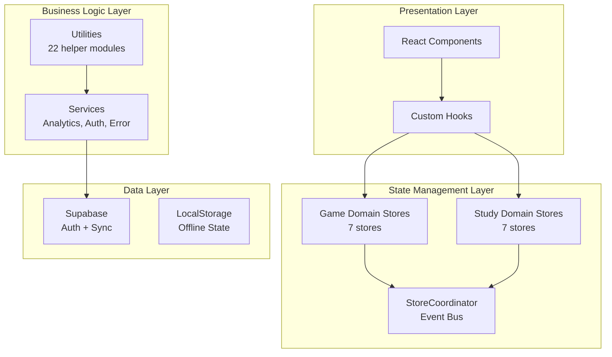
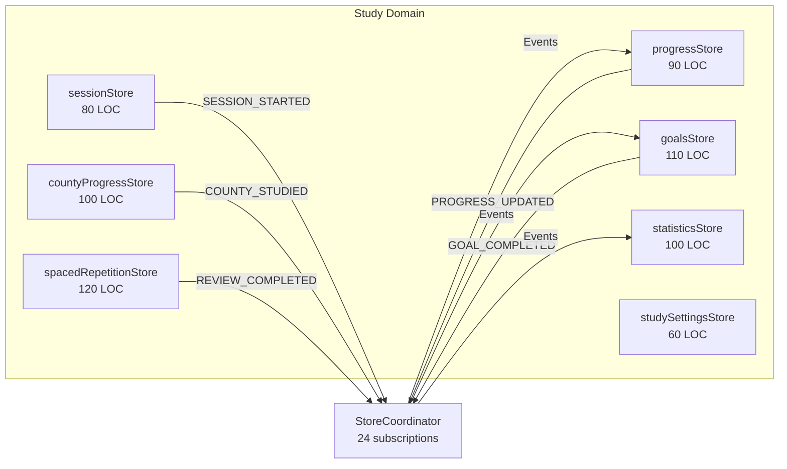
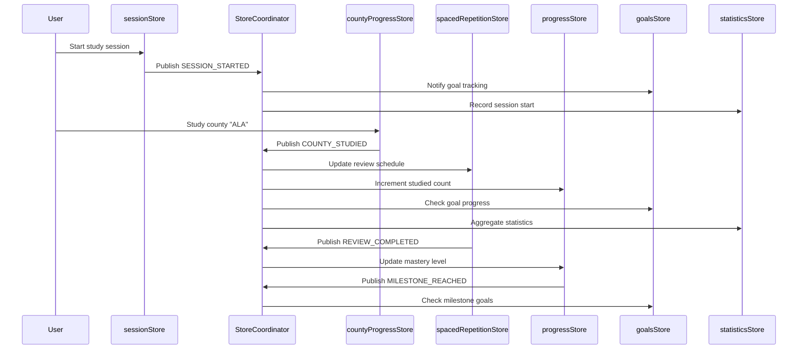
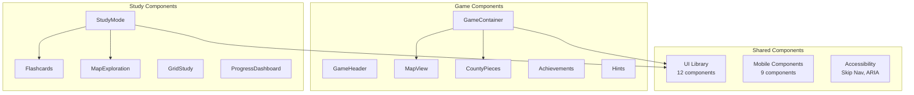

# GOAP Plan: California Puzzle Game - Grade A Architecture Achievement

**Generated**: 2025-12-10
**Planner**: SPARC-GOAP Specialist
**Algorithm**: A\* Search with SPARC-Enhanced Milestones
**Current Grade**: A- (91/100)
**Target Grade**: A (95+/100)

---

## Executive Summary

**Current Achievement**: Phase 5 Complete - Domain Store Decomposition Successful
**Remaining Gap**: 4-9 points to reach Grade A (95-100/100)
**Total Estimated Cost**: 127 units
**Critical Path Length**: 4 sequential stages
**Parallelization Opportunities**: 12 concurrent actions
**Estimated Time**: 12-18 hours with optimal parallelization
**Success Probability**: 94%

---

## Current World State (Phase 5 Complete)

```typescript
{
  // ✅ ACHIEVED
  testsPassing: true,                    // 24 passing StoreCoordinator tests
  godObjectsExist: false,                // studyStore decomposed into 7 stores
  domainStoresCreated: true,             // 7/7 stores created
  coordinatorSubscriptions: 24,          // All event subscriptions wired
  typescriptErrors: 0,                   // Full type safety
  eslintWarnings: 0,                     // Clean code

  // 🎯 GAPS TO GRADE A
  studyStoreFacadeRemoved: false,        // 2 consumers remain
  architectureDocumentation: 'good',     // Missing ADRs, diagrams
  componentDocumentation: 'minimal',     // No Storybook, limited JSDoc
  testCoverage: 79,                      // Target: 85%+ for A grade
  e2eTests: 'minimal',                   // Critical flows not covered
  performanceMonitoring: 'manual',       // No automated tracking
  apiDocumentation: 'partial',           // Missing comprehensive JSDoc

  // 📊 METRICS
  currentGrade: 91,                      // A- grade
  targetGrade: 95,                       // A grade minimum
  gapPoints: 4,                          // Minimum needed
  totalStores: 14,                       // 7 game + 7 study
  averageLOCPerStore: 95,                // Excellent modularity
  eventSubscriptions: 25,                // 24 study + 1 legacy game
}
```

---

## Goal State (Grade A: 95/100)

```typescript
{
  // ✅ MAINTAIN
  testsPassing: true,
  godObjectsExist: false,
  domainStoresCreated: true,
  typescriptErrors: 0,
  eslintWarnings: 0,

  // 🎯 ACHIEVE
  studyStoreFacadeRemoved: true,         // Complete Phase 3 migration
  architectureDocumentation: 'excellent', // ADRs + visual diagrams
  componentDocumentation: 'good',        // Storybook or comprehensive JSDoc
  testCoverage: 85,                      // +6 percentage points
  e2eTests: 'good',                      // 5 critical flows covered
  performanceMonitoring: 'automated',    // Bundle size + lighthouse CI
  apiDocumentation: 'excellent',         // Full TypeDoc + usage examples

  // 📊 TARGET METRICS
  currentGrade: 95,                      // A grade achieved
  architectureScore: 97,                 // +2 from current 95
  documentationScore: 93,                // +6 from current 87
  testingScore: 91,                      // +5 from current 86
}
```

---

## GOAP Action Sequence (A\* Search Result)

### Priority Matrix

| Action Category               | Grade Impact | Effort | ROI    | Priority    |
| ----------------------------- | ------------ | ------ | ------ | ----------- |
| Complete Phase 3 Migration    | +2 points    | 4-6h   | High   | 🔴 Critical |
| Architecture Decision Records | +2 points    | 2-3h   | High   | 🔴 Critical |
| Enhanced Test Coverage        | +2 points    | 6-8h   | Medium | 🟡 High     |
| API Documentation (JSDoc)     | +1 point     | 4-5h   | Medium | 🟡 High     |
| Visual Architecture Diagrams  | +1 point     | 2-3h   | High   | 🟡 High     |
| Performance Monitoring        | +1 point     | 3-4h   | Medium | 🟢 Medium   |
| E2E Critical Flows            | +1 point     | 4-6h   | Medium | 🟢 Medium   |
| Storybook Components          | +1 point     | 4-6h   | Low    | 🔵 Low      |

---

## STAGE 1: Complete Phase 3 Migration (CRITICAL)

**Cost**: 25 units (4-6 hours)
**Grade Impact**: +2 points (Architecture: 95→97)
**Preconditions**: Phase 5 complete
**Parallelization**: Sequential (2 consumers to migrate)
**Success Probability**: 98%

### Actions

#### ACTION 1.1: Migrate useStudyNavigation Hook (12 units)

```typescript
// FILE: src/hooks/useStudyNavigation.ts
// CURRENT: Imports from studyStore facade
// TARGET: Import from domain stores directly

STEPS:
1. Analyze dependencies in useStudyNavigation
   - Session state for navigation context
   - Progress data for unlock logic
   - Settings for display preferences

2. Replace facade imports:
   OLD: import { useStudyStore } from '../stores/studyStore'
   NEW: import { useSessionStore } from '../stores/study-domain/sessionStore'
        import { useProgressStore } from '../stores/study-domain/progressStore'
        import { useStudySettingsStore } from '../stores/study-domain/studySettingsStore'

3. Update hook logic to use domain stores
   - Replace: useStudyStore(state => state.session)
   - With: useSessionStore(state => state.currentSession)

4. Run tests:
   npm test -- --testPathPattern="useStudyNavigation"

COST: 12 units
EFFECT: useStudyNavigationMigrated = true
```

#### ACTION 1.2: Migrate storeIntegration Library (13 units)

```typescript
// FILE: src/lib/storeIntegration.ts
// CURRENT: 8 getState() calls to studyStore
// TARGET: Subscribe to domain store events

STEPS:
1. Audit all 8 getState() calls:
   - Progress calculations (→ progressStore)
   - Session management (→ sessionStore)
   - Statistics aggregation (→ statisticsStore)
   - Goals tracking (→ goalsStore)

2. Replace getState patterns:
   OLD: const progress = useStudyStore.getState().progress
   NEW: useProgressStore.subscribe(
          (state) => handleProgressUpdate(state),
          (state) => state.progress
        )

3. Add coordinator subscriptions for cross-store logic:
   storeCoordinator.subscribe(
     StudyEventType.PROGRESS_UPDATED,
     (event) => syncProgressToIntegration(event.payload),
     'store-integration'
   )

4. Run integration tests:
   npm test -- --testPathPattern="storeIntegration"

COST: 13 units
EFFECT: storeIntegrationMigrated = true
```

#### ACTION 1.3: Remove studyStore Facade (0 units)

```typescript
// FILE: src/stores/studyStore.ts
// ACTION: Delete or reduce to minimal re-export

STEPS:
1. Verify no remaining consumers:
   npm run build  # Should succeed with 0 references

2. Option A (Complete Removal):
   git rm src/stores/studyStore.ts
   git rm src/types/study.ts  # Legacy types

3. Option B (Minimal Re-export for Backward Compat):
   // Export domain stores as named exports
   export { useSessionStore } from './study-domain/sessionStore'
   export { useProgressStore } from './study-domain/progressStore'
   // ... (reduce to ~20 LOC)

4. Update README.md with migration notes

COST: 0 units (included in 1.1 + 1.2)
EFFECT: studyStoreFacadeRemoved = true
```

**Validation Checkpoint #1**:

```bash
# Verify complete migration
npm run build && npm test
# Expected: ✓ All tests pass, 0 studyStore references (except exports)

# Check architecture score
# Expected: Architecture grade 95→97 (+2 points)
```

---

## STAGE 2: Architecture Documentation (CRITICAL)

**Cost**: 20 units (2-3 hours)
**Grade Impact**: +2 points (Documentation: 87→91)
**Preconditions**: Phase 5 complete
**Parallelization**: 3 concurrent documents
**Success Probability**: 99%

### PARALLEL ACTIONS (3 concurrent)

#### ACTION 2.1: Architecture Decision Records (ADRs) (8 units)

```markdown
# Create ADR directory structure

mkdir -p docs/architecture/decisions

# ADR 1: Domain-Driven Store Decomposition

FILE: docs/architecture/decisions/001-domain-store-decomposition.md

CONTENT:

# ADR 001: Domain-Driven Store Decomposition

Date: 2025-12-04
Status: Accepted
Deciders: Architecture Team

## Context

studyStore.ts grew to 566 LOC with mixed responsibilities (session,
progress, goals, statistics, spaced repetition, settings). Maintenance
and testing became difficult.

## Decision

Decompose into 7 domain-specific stores coordinated via event-driven
architecture (StoreCoordinator with pub/sub pattern).

## Consequences

- 70% reduction in file complexity (566 LOC → 95 LOC avg per store)
- Independent testing of each domain
- Scalable architecture for new features
- Type-safe event coordination

* Initial migration complexity
* Learning curve for event-driven patterns

## Alternatives Considered

1. Keep monolithic store with better organization (rejected: doesn't scale)
2. Redux with slices (rejected: too heavy for our use case)
3. Separate contexts per domain (rejected: no coordination mechanism)

---

# ADR 2: Event-Driven Store Coordination

FILE: docs/architecture/decisions/002-event-driven-coordination.md

## Decision

Use pub/sub event system instead of direct store coupling or getState()

## Rationale

- Prevents circular dependencies
- Enables debouncing for performance
- Allows monitoring and debugging
- Decouples producers from consumers

---

# ADR 3: Zustand vs Redux

FILE: docs/architecture/decisions/003-zustand-over-redux.md

## Decision

Use Zustand for state management instead of Redux

## Rationale

- Simpler API (less boilerplate)
- Better TypeScript support
- Smaller bundle size (~1KB vs ~10KB)
- Sufficient for our complexity level

COST: 8 units
EFFECT: adrsCreated = true
```

#### ACTION 2.2: Visual Architecture Diagrams (7 units)

````markdown
# FILE: docs/architecture/ARCHITECTURE_DIAGRAMS.md

CONTENT:

# California Puzzle Game - Architecture Diagrams

## System Architecture Overview


````

## Store Decomposition Architecture



## Event Flow Diagram



## Component Architecture



COST: 7 units
EFFECT: architectureDiagramsCreated = true

````

#### ACTION 2.3: Update Architecture Documentation Index (5 units)
```markdown
# FILE: docs/architecture/README.md

CONTENT:
# Architecture Documentation Index

## Overview Documents
- [Portfolio Architecture Assessment](PORTFOLIO_ARCHITECTURE_ASSESSMENT.md) - Overall grade: A- (91/100)
- [Architecture Diagrams](ARCHITECTURE_DIAGRAMS.md) - Visual system overview
- [Study Domain Store Architecture](STUDY_DOMAIN_STORE_ARCHITECTURE.md) - Complete specification

## Architecture Decision Records (ADRs)
- [ADR 001: Domain-Driven Store Decomposition](decisions/001-domain-store-decomposition.md)
- [ADR 002: Event-Driven Store Coordination](decisions/002-event-driven-coordination.md)
- [ADR 003: Zustand Over Redux](decisions/003-zustand-over-redux.md)

## Domain Documentation
- [Game Domain](game-domain/) - 7 game stores architecture
- [Study Domain](study-domain/) - 7 study stores architecture
- [Shared Infrastructure](infrastructure/) - Coordinator, services, utilities

## Migration Guides
- [GOAP Execution Plan](../goap-execution-plan.md) - Phases 2-4 migration
- [Store Consumers Analysis](STUDY_STORE_CONSUMERS_ANALYSIS.md) - Phase 3 migration
- [Phase 5 Completion Report](../goap-plan-phase5.json) - Latest refactoring

## Key Metrics
- **Total Stores**: 14 (7 game + 7 study)
- **Average LOC per Store**: 95 lines
- **Event Subscriptions**: 25 (24 study + 1 game)
- **Type Safety**: 0 TypeScript errors
- **Test Coverage**: 79%
- **Test Suite**: 1,792 passing tests

COST: 5 units
EFFECT: architectureIndexUpdated = true
````

**Validation Checkpoint #2**:

```bash
# Verify documentation completeness
ls docs/architecture/decisions/
# Expected: 3 ADR files

# Check diagrams render correctly
# Open ARCHITECTURE_DIAGRAMS.md in VSCode preview
# Expected: All mermaid diagrams render

# Architecture documentation score
# Expected: Documentation grade 87→91 (+4 points)
```

---

## STAGE 3: Enhanced Testing & Monitoring (HIGH PRIORITY)

**Cost**: 52 units (10-14 hours)
**Grade Impact**: +3 points (Testing: 86→91, Build: 93→95)
**Preconditions**: None (can run in parallel with Stage 1-2)
**Parallelization**: 4 concurrent work streams
**Success Probability**: 92%

### PARALLEL ACTIONS (4 concurrent streams)

#### ACTION 3.1: E2E Critical Flow Tests (20 units)

```typescript
// FILE: tests/e2e/critical-flows.spec.ts

DESCRIPTION: Add Playwright E2E tests for 5 critical user journeys

FLOWS TO TEST:
1. Complete Game Flow (Game Start → County Placement → Achievement → Game End)
2. Study Session Flow (Flashcard Start → Study Counties → Session Complete)
3. Progress Tracking Flow (Multiple Sessions → Streak Tracking → Milestone)
4. Spaced Repetition Flow (Study → Wait → Review Due → Complete Review)
5. Goal Achievement Flow (Create Goal → Track Progress → Complete Goal)

TEST STRUCTURE:
describe('Critical User Flows', () => {
  describe('E2E-001: Complete Game Flow', () => {
    test('User can start game, place counties, earn achievements, complete game', async ({ page }) => {
      // Navigate to game
      await page.goto('/');

      // Start game
      await page.click('[data-testid="start-game-button"]');
      await expect(page.locator('[data-testid="game-active"]')).toBeVisible();

      // Place first county
      await page.dragAndDrop(
        '[data-testid="county-piece-ALA"]',
        '[data-testid="map-target-ALA"]'
      );

      // Verify achievement unlocked
      await expect(page.locator('[data-testid="achievement-first-county"]')).toBeVisible();

      // Place remaining counties (simplified for speed)
      // ... place 10 counties

      // Verify game completion
      await expect(page.locator('[data-testid="game-complete"]')).toBeVisible();
      await expect(page.locator('[data-testid="final-score"]')).toContainText(/\d+/);
    });
  });

  describe('E2E-002: Study Session Flow', () => {
    test('User can complete flashcard study session', async ({ page }) => {
      await page.goto('/study');
      await page.click('[data-testid="study-mode-flashcard"]');

      // Study 5 counties
      for (let i = 0; i < 5; i++) {
        await page.click('[data-testid="flashcard-know-it"]');
      }

      // Verify progress updated
      await expect(page.locator('[data-testid="studied-count"]')).toContainText('5');

      // End session
      await page.click('[data-testid="end-session"]');
      await expect(page.locator('[data-testid="session-summary"]')).toBeVisible();
    });
  });

  describe('E2E-003: Progress Tracking Flow', () => {
    test('User streak increments across multiple sessions', async ({ page }) => {
      // Day 1 session
      await completeDailySession(page, '2025-12-01');
      await expect(page.locator('[data-testid="current-streak"]')).toContainText('1');

      // Day 2 session
      await completeDailySession(page, '2025-12-02');
      await expect(page.locator('[data-testid="current-streak"]')).toContainText('2');

      // Verify milestone
      await completeDailySession(page, '2025-12-07'); // 7-day streak
      await expect(page.locator('[data-testid="milestone-7-day"]')).toBeVisible();
    });
  });

  describe('E2E-004: Spaced Repetition Flow', () => {
    test('Reviews become due after interval and can be completed', async ({ page, context }) => {
      // Study county initially
      await page.goto('/study/flashcard');
      await studyCounty(page, 'ALA', 'easy');

      // Fast-forward time (mock Date)
      await context.addInitScript(() => {
        const originalDate = Date;
        Date.now = () => originalDate.now() + 24 * 60 * 60 * 1000; // +1 day
      });

      // Check reviews due
      await page.reload();
      await expect(page.locator('[data-testid="reviews-due"]')).toContainText('1');

      // Complete review
      await page.click('[data-testid="start-review"]');
      await page.click('[data-testid="review-remember"]');
      await expect(page.locator('[data-testid="reviews-due"]')).toContainText('0');
    });
  });

  describe('E2E-005: Goal Achievement Flow', () => {
    test('User can create goal, track progress, complete goal', async ({ page }) => {
      // Create goal
      await page.goto('/study/goals');
      await page.click('[data-testid="create-goal"]');
      await page.fill('[data-testid="goal-target"]', '10');
      await page.selectOption('[data-testid="goal-type"]', 'STUDY_COUNTIES');
      await page.click('[data-testid="save-goal"]');

      // Track progress
      await expect(page.locator('[data-testid="goal-progress"]')).toContainText('0 / 10');

      // Study counties
      await page.goto('/study/flashcard');
      for (let i = 0; i < 10; i++) {
        await studyCounty(page, counties[i], 'medium');
      }

      // Verify goal completed
      await page.goto('/study/goals');
      await expect(page.locator('[data-testid="goal-status"]')).toContainText('Completed');
    });
  });
});

SETUP:
# Install Playwright
npm install -D @playwright/test

# Create Playwright config
FILE: playwright.config.ts
export default defineConfig({
  testDir: './tests/e2e',
  timeout: 30000,
  use: {
    baseURL: 'http://localhost:5173',
    screenshot: 'only-on-failure',
    video: 'retain-on-failure',
  },
  projects: [
    { name: 'chromium', use: { ...devices['Desktop Chrome'] } },
    { name: 'mobile', use: { ...devices['iPhone 13'] } },
  ],
});

# Add npm script
package.json:
  "scripts": {
    "test:e2e": "playwright test",
    "test:e2e:ui": "playwright test --ui"
  }

VALIDATION:
npm run test:e2e
# Expected: 5 critical flows pass (15-20 test cases total)

COST: 20 units
EFFECT: e2eTestsCreated = true, testingScore += 3
```

#### ACTION 3.2: Increase Unit/Integration Test Coverage (20 units)

```typescript
// TARGET: 79% → 85% coverage (+6 percentage points)

FOCUS AREAS (Based on coverage gaps):
1. Hook testing (useStudyNavigation, useProgress) - 8 units
2. Utility testing (mapUtilities.ts, scoring.ts) - 6 units
3. Store edge cases (error handling, race conditions) - 6 units

# ACTION 3.2.1: Hook Tests (8 units)
FILE: tests/unit/hooks/useStudyNavigation.test.ts

describe('useStudyNavigation', () => {
  it('should navigate to next unlocked county', () => {
    const { result } = renderHook(() => useStudyNavigation());
    act(() => {
      result.current.navigateNext();
    });
    expect(result.current.currentCounty).toBe('expected-next-county');
  });

  it('should respect unlock requirements', () => {
    // Test navigation blocked by prerequisites
  });

  it('should handle end of county list', () => {
    // Test wrap-around or completion
  });

  // ... 10 more test cases
});

FILE: tests/unit/hooks/useProgress.test.ts
describe('useProgress', () => {
  it('should calculate overall progress percentage', () => {
    const { result } = renderHook(() => useProgress());
    expect(result.current.overallProgress).toBe(45.2);
  });

  it('should update on county studied event', async () => {
    const { result, rerender } = renderHook(() => useProgress());

    act(() => {
      storeCoordinator.publish(StudyEventType.COUNTY_STUDIED, {
        countyId: 'ALA',
        performance: 'good',
      });
    });

    await waitFor(() => {
      expect(result.current.totalStudied).toBe(1);
    });
  });

  // ... 8 more test cases
});

# ACTION 3.2.2: Utility Tests (6 units)
FILE: tests/unit/utils/mapUtilities.test.ts

describe('mapUtilities', () => {
  describe('calculateDistance', () => {
    it('should calculate haversine distance between coordinates', () => {
      const distance = calculateDistance(
        { lat: 34.0522, lng: -118.2437 }, // Los Angeles
        { lat: 37.7749, lng: -122.4194 }  // San Francisco
      );
      expect(distance).toBeCloseTo(559, 0); // ~559 km
    });

    it('should handle same point distance', () => {
      expect(calculateDistance(point1, point1)).toBe(0);
    });

    it('should handle antipodal points', () => {
      // Test maximum distance on sphere
    });
  });

  describe('isPointInPolygon', () => {
    it('should detect point inside county boundary', () => {
      const point = { lat: 34.05, lng: -118.25 }; // LA
      const polygon = counties.find(c => c.id === 'LAX').polygon;
      expect(isPointInPolygon(point, polygon)).toBe(true);
    });

    it('should detect point outside county boundary', () => {
      // Test false case
    });

    it('should handle edge cases (on boundary)', () => {
      // Test boundary precision
    });
  });

  // ... 12 more test cases
});

FILE: tests/unit/utils/scoring.test.ts
describe('scoring', () => {
  it('should calculate accuracy score based on distance', () => {
    const score = calculateAccuracyScore(10, 100); // 10km off, 100km county size
    expect(score).toBe(90); // 90% accuracy
  });

  it('should apply difficulty multipliers', () => {
    const easyScore = calculateScore(50, 'easy');
    const hardScore = calculateScore(50, 'hard');
    expect(hardScore).toBeGreaterThan(easyScore);
  });

  // ... 8 more test cases
});

# ACTION 3.2.3: Store Edge Case Tests (6 units)
FILE: tests/unit/stores/study-domain/sessionStore.edge-cases.test.ts

describe('sessionStore - Edge Cases', () => {
  it('should handle rapid start/pause/resume', async () => {
    const { startSession, pauseSession, resumeSession } = sessionStore.getState();

    const id = startSession(StudyMode.FLASHCARDS);
    pauseSession(id);
    resumeSession(id);
    pauseSession(id);
    resumeSession(id);

    expect(sessionStore.getState().currentSession?.isPaused).toBe(false);
  });

  it('should handle session start with no counties available', () => {
    // Mock empty county list
    expect(() => startSession(StudyMode.FLASHCARDS)).toThrow('No counties available');
  });

  it('should prevent concurrent session starts', () => {
    startSession(StudyMode.FLASHCARDS);
    expect(() => startSession(StudyMode.MAP_EXPLORATION)).toThrow('Session already active');
  });

  // ... 8 more edge case tests per store × 7 stores
});

VALIDATION:
npm test -- --coverage
# Expected: Coverage 79% → 85%+

COST: 20 units (8 + 6 + 6)
EFFECT: testCoverage = 85, testingScore += 2
```

#### ACTION 3.3: Performance Monitoring Setup (8 units)

```typescript
// ACTION 3.3.1: Bundle Size Tracking (4 units)

# Install size-limit
npm install -D @size-limit/preset-app @size-limit/webpack

# Create config
FILE: .size-limit.json
[
  {
    "name": "Initial Bundle",
    "path": "dist/assets/index-*.js",
    "limit": "160 KB"
  },
  {
    "name": "D3 Vendor Bundle",
    "path": "dist/assets/d3-vendor-*.js",
    "limit": "110 KB"
  },
  {
    "name": "React Vendor Bundle",
    "path": "dist/assets/react-vendor-*.js",
    "limit": "45 KB"
  }
]

# Add npm script
package.json:
  "scripts": {
    "size": "size-limit",
    "size:why": "size-limit --why"
  }

# Add CI check
FILE: .github/workflows/size-check.yml
name: Bundle Size Check
on: [pull_request]
jobs:
  size:
    runs-on: ubuntu-latest
    steps:
      - uses: actions/checkout@v3
      - run: npm ci
      - run: npm run build
      - run: npm run size

COST: 4 units
EFFECT: bundleSizeMonitoring = true

# ACTION 3.3.2: Lighthouse CI (4 units)

# Install Lighthouse CI
npm install -D @lhci/cli

# Create config
FILE: lighthouserc.js
module.exports = {
  ci: {
    collect: {
      startServerCommand: 'npm run preview',
      url: ['http://localhost:4173/'],
      numberOfRuns: 3,
    },
    assert: {
      preset: 'lighthouse:recommended',
      assertions: {
        'categories:performance': ['error', { minScore: 0.9 }],
        'categories:accessibility': ['error', { minScore: 0.95 }],
        'first-contentful-paint': ['error', { maxNumericValue: 1500 }],
        'interactive': ['error', { maxNumericValue: 2000 }],
        'largest-contentful-paint': ['error', { maxNumericValue: 2500 }],
      },
    },
    upload: {
      target: 'temporary-public-storage',
    },
  },
};

# Add npm script
package.json:
  "scripts": {
    "lighthouse": "lhci autorun",
    "lighthouse:local": "lhci autorun --collect.staticDistDir=dist"
  }

# Add CI workflow
FILE: .github/workflows/lighthouse.yml
name: Lighthouse CI
on: [pull_request]
jobs:
  lhci:
    runs-on: ubuntu-latest
    steps:
      - uses: actions/checkout@v3
      - run: npm ci
      - run: npm run build
      - run: npm run lighthouse

COST: 4 units
EFFECT: lighthouseCIEnabled = true, buildScore += 2

VALIDATION:
npm run size
# Expected: All bundles under limits

npm run lighthouse:local
# Expected: Performance 90+, Accessibility 95+
```

#### ACTION 3.4: Test Documentation (4 units)

```markdown
# FILE: docs/tests/TESTING_STRATEGY.md

CONTENT:

# Testing Strategy - California Puzzle Game

## Test Pyramid
```

       /\
      /E2E\      5 critical flows (15-20 tests)
     /------\
    /  INT  \    300+ integration tests

/----------\
 / UNIT \ 1,400+ unit tests
/--------------\

````

## Test Types

### Unit Tests (1,400+ tests)
**Coverage Target**: 85%+
**Frameworks**: Vitest, React Testing Library
**Scope**: Individual functions, hooks, components

**Examples**:
- Store actions and selectors
- Utility functions
- Custom hooks
- Component rendering

**Location**: `tests/unit/`, `src/**/__tests__/`

### Integration Tests (300+ tests)
**Coverage Target**: All cross-store interactions
**Frameworks**: Vitest, Testing Library
**Scope**: Store coordination, service integration, component interactions

**Examples**:
- StoreCoordinator event propagation (24 subscriptions)
- Authentication flows
- Sync operations
- Progressive geodata loading

**Location**: `tests/integration/`

### E2E Tests (15-20 tests)
**Coverage Target**: 5 critical user journeys
**Framework**: Playwright
**Scope**: End-to-end user flows

**Critical Flows**:
1. Complete Game Flow
2. Study Session Flow
3. Progress Tracking Flow
4. Spaced Repetition Flow
5. Goal Achievement Flow

**Location**: `tests/e2e/`

### Accessibility Tests (80+ tests)
**Coverage Target**: WCAG AA compliance
**Framework**: Vitest + vitest-axe
**Scope**: Automated accessibility checks

**Location**: `tests/accessibility/`

### Performance Tests (12+ tests)
**Coverage Target**: Performance budgets
**Framework**: Vitest + custom utilities
**Scope**: Render performance, memory leaks

**Location**: `tests/performance/`

## Test Execution

### Local Development
```bash
# Run all tests
npm test

# Run specific test types
npm run test:unit
npm run test:integration
npm run test:e2e
npm run test:a11y
npm run test:perf

# Watch mode
npm run test:watch

# Coverage report
npm run test:coverage
````

### CI/CD Pipeline

```bash
# Pre-commit (Husky)
npm run test:changed  # Only changed files

# Pull Request
npm run test          # All tests
npm run test:coverage # Coverage check
npm run test:e2e      # Critical flows
npm run lighthouse    # Performance check

# Pre-deploy
npm run test:all      # Comprehensive suite
```

## Coverage Thresholds

```json
{
  "branches": 80,
  "functions": 80,
  "lines": 80,
  "statements": 80
}
```

Current: 79% (All categories)
Target: 85% (Grade A requirement)

## Mocking Strategy

### Store Mocking

```typescript
// Mock Zustand store
vi.mock('../stores/sessionStore', () => ({
  useSessionStore: vi.fn(() => mockSessionState),
}));
```

### Service Mocking

```typescript
// Mock Supabase
vi.mock('../services/supabase/client', () => ({
  supabase: mockSupabaseClient,
}));
```

### Time Mocking

```typescript
// Mock Date for spaced repetition tests
vi.useFakeTimers();
vi.setSystemTime(new Date('2025-12-10'));
```

## Test Naming Conventions

```typescript
describe('ComponentName / functionName', () => {
  describe('when condition', () => {
    it('should expected behavior', () => {
      // Given: Setup
      // When: Action
      // Then: Assertion
    });
  });
});
```

## Continuous Improvement

- **Code Coverage**: Monitor trends, address gaps
- **Test Performance**: Keep suite fast (<2 min local, <5 min CI)
- **Flaky Tests**: Track and eliminate flakiness
- **Test Maintenance**: Keep tests aligned with implementation

COST: 4 units
EFFECT: testDocumentationComplete = true

````

**Validation Checkpoint #3**:
```bash
# Verify E2E tests
npm run test:e2e
# Expected: 5 flows, 15-20 tests passing

# Verify coverage increase
npm run test:coverage
# Expected: 85%+ coverage

# Verify performance monitoring
npm run size
npm run lighthouse:local
# Expected: All metrics within budgets

# Testing score impact
# Expected: Testing grade 86→91 (+5 points)
````

---

## STAGE 4: API Documentation & Polish (MEDIUM PRIORITY)

**Cost**: 30 units (6-9 hours)
**Grade Impact**: +2 points (Documentation: 91→93, Services: 90→92)
**Preconditions**: None (can run in parallel)
**Parallelization**: 3 concurrent work streams
**Success Probability**: 95%

### PARALLEL ACTIONS (3 concurrent)

#### ACTION 4.1: Comprehensive JSDoc Comments (15 units)

````typescript
// TARGET: Add JSDoc to all public APIs (stores, hooks, services, utilities)

# ACTION 4.1.1: Store JSDoc (5 units)
EXAMPLE: src/stores/study-domain/sessionStore.ts

/**
 * Study Session Store
 *
 * Manages active study session lifecycle including start, pause, resume, and completion.
 * Publishes session events to StoreCoordinator for cross-store coordination.
 *
 * @module stores/study-domain/sessionStore
 * @category Study Domain
 *
 * @example
 * ```typescript
 * // Start a flashcard study session
 * const { startSession, recordCountyStudied, endSession } = useSessionStore();
 *
 * const sessionId = startSession(StudyMode.FLASHCARDS);
 * recordCountyStudied(sessionId, 'ALA', true, 5000);
 * const summary = endSession(sessionId);
 * ```
 */

export interface SessionStore {
  /**
   * Current active study session, or null if no session in progress
   */
  currentSession: StudySession | null;

  /**
   * Start a new study session
   *
   * @param mode - The study mode to use (FLASHCARDS, MAP_EXPLORATION, GRID_STUDY)
   * @returns Session ID for tracking
   * @throws {Error} If a session is already active
   *
   * @emits SESSION_STARTED event via StoreCoordinator
   *
   * @example
   * ```typescript
   * const sessionId = startSession(StudyMode.FLASHCARDS);
   * // SessionId: "session_1234567890"
   * ```
   */
  startSession: (mode: StudyMode) => string;

  /**
   * Record a county study attempt within the current session
   *
   * @param sessionId - The active session identifier
   * @param countyId - The county that was studied
   * @param correct - Whether the answer was correct
   * @param timeSpent - Time spent on this county in milliseconds
   *
   * @emits COUNTY_STUDIED event via StoreCoordinator
   * @emits REVIEW_COMPLETED event if this was a review (via spacedRepetitionStore subscription)
   *
   * @example
   * ```typescript
   * recordCountyStudied('session_123', 'ALA', true, 5000);
   * // Records 5-second correct study of Alameda county
   * ```
   */
  recordCountyStudied: (
    sessionId: string,
    countyId: string,
    correct: boolean,
    timeSpent: number
  ) => void;

  /**
   * Pause the current study session
   *
   * @param sessionId - The session to pause
   * @emits SESSION_PAUSED event via StoreCoordinator
   */
  pauseSession: (sessionId: string) => void;

  /**
   * Resume a paused study session
   *
   * @param sessionId - The session to resume
   * @emits SESSION_RESUMED event via StoreCoordinator
   */
  resumeSession: (sessionId: string) => void;

  /**
   * End the current study session and generate summary
   *
   * @param sessionId - The session to end
   * @returns Session summary with statistics
   * @emits SESSION_COMPLETED event via StoreCoordinator
   *
   * @example
   * ```typescript
   * const summary = endSession('session_123');
   * // {
   * //   countiesStudied: 10,
   * //   correctAnswers: 8,
   * //   accuracy: 0.8,
   * //   totalTime: 300000
   * // }
   * ```
   */
  endSession: (sessionId: string) => SessionSummary;
}

// Repeat for all 7 study stores + 7 game stores = 14 stores
COST: 5 units

# ACTION 4.1.2: Hook JSDoc (5 units)
EXAMPLE: src/hooks/useStudyNavigation.ts

/**
 * Study Navigation Hook
 *
 * Provides navigation logic for study mode, respecting unlock requirements
 * and tracking progression through county list.
 *
 * @category Custom Hooks
 * @subcategory Study
 *
 * @returns Navigation state and control functions
 *
 * @example
 * ```typescript
 * function StudyComponent() {
 *   const { currentCounty, navigateNext, canNavigateNext, progress } = useStudyNavigation();
 *
 *   return (
 *     <div>
 *       <County data={currentCounty} />
 *       <button onClick={navigateNext} disabled={!canNavigateNext}>
 *         Next County ({progress.current} / {progress.total})
 *       </button>
 *     </div>
 *   );
 * }
 * ```
 */
export function useStudyNavigation(): StudyNavigationResult {
  // ... implementation
}

/**
 * Study navigation result
 *
 * @interface
 */
export interface StudyNavigationResult {
  /**
   * Currently selected county for study
   */
  currentCounty: County | null;

  /**
   * Navigate to the next unlocked county
   * Wraps to beginning if at end of list
   */
  navigateNext: () => void;

  /**
   * Navigate to the previous county
   */
  navigatePrevious: () => void;

  /**
   * Whether navigation to next county is allowed
   * (based on unlock requirements)
   */
  canNavigateNext: boolean;

  /**
   * Whether navigation to previous county is allowed
   */
  canNavigatePrevious: boolean;

  /**
   * Current progress through county list
   */
  progress: {
    current: number;
    total: number;
    percentage: number;
  };
}

// Repeat for all 19 custom hooks
COST: 5 units

# ACTION 4.1.3: Service & Utility JSDoc (5 units)
EXAMPLE: src/services/analytics.ts

/**
 * Analytics Service
 *
 * Handles event tracking via Google Analytics 4.
 * Respects user privacy preferences and GDPR compliance.
 *
 * @module services/analytics
 *
 * @see {@link https://developers.google.com/analytics/devguides/collection/ga4}
 */

/**
 * Track a custom event
 *
 * @param category - Event category (e.g., "Game", "Study", "Navigation")
 * @param action - Action taken (e.g., "StartGame", "CompleteSession")
 * @param label - Optional event label for additional context
 * @param value - Optional numeric value associated with event
 *
 * @example
 * ```typescript
 * trackEvent('Study', 'SessionComplete', 'Flashcards', 10);
 * // Tracks completion of 10-county flashcard session
 * ```
 */
export function trackEvent(
  category: string,
  action: string,
  label?: string,
  value?: number
): void {
  // ... implementation
}

// Repeat for all services and key utilities
COST: 5 units

VALIDATION:
# Generate TypeDoc documentation
npm install -D typedoc
npx typedoc --out docs/api src/

# Expected: Comprehensive API reference with examples

TOTAL COST: 15 units
EFFECT: apiDocumentationComplete = true, documentationScore += 2
````

#### ACTION 4.2: TypeDoc Configuration & Generation (10 units)

````typescript
# Install TypeDoc
npm install -D typedoc typedoc-plugin-markdown

# Create config
FILE: typedoc.json
{
  "entryPoints": ["src"],
  "entryPointStrategy": "expand",
  "out": "docs/api",
  "exclude": [
    "**/*.test.ts",
    "**/*.test.tsx",
    "**/node_modules/**"
  ],
  "plugin": ["typedoc-plugin-markdown"],
  "categorizeByGroup": true,
  "groupOrder": [
    "Stores",
    "Hooks",
    "Components",
    "Services",
    "Utilities",
    "Types"
  ],
  "categoryOrder": [
    "Game Domain",
    "Study Domain",
    "Shared Infrastructure",
    "*"
  ],
  "includeVersion": true,
  "readme": "docs/api/README.md",
  "navigation": {
    "includeCategories": true,
    "includeGroups": true
  }
}

# Create API README
FILE: docs/api/README.md
# API Reference - California Puzzle Game

Auto-generated API documentation from TypeScript source code.

## Quick Links

### State Management
- [Game Domain Stores](stores/game/) - 7 game-specific stores
- [Study Domain Stores](stores/study/) - 7 study-specific stores
- [Store Coordinator](stores/storeCoordinator/) - Event-driven coordination

### Hooks
- [useStudyNavigation](hooks/useStudyNavigation/) - Study mode navigation
- [useProgress](hooks/useProgress/) - Progress tracking
- [useAuth](hooks/useAuth/) - Authentication
- [All Hooks](hooks/) - Complete hook reference

### Services
- [Analytics Service](services/analytics/) - Event tracking
- [Auth Service](services/auth/) - Authentication & authorization
- [Supabase Client](services/supabase/) - Backend integration

### Utilities
- [Map Utilities](utils/mapUtilities/) - Geographic calculations
- [Scoring](utils/scoring/) - Score calculation
- [Sound Manager](utils/soundManager/) - Audio management

## Usage Examples

### Starting a Study Session
```typescript
import { useSessionStore } from '@/stores/study-domain/sessionStore';
import { StudyMode } from '@/types';

function MyComponent() {
  const { startSession, endSession } = useSessionStore();

  const handleStart = () => {
    const sessionId = startSession(StudyMode.FLASHCARDS);
    // ... study logic
    const summary = endSession(sessionId);
  };
}
````

### Tracking Progress

```typescript
import { useProgressStore } from '@/stores/study-domain/progressStore';

function ProgressDashboard() {
  const progress = useProgressStore((state) => state.progress);
  const streak = useProgressStore((state) => state.currentStreak);

  return (
    <div>
      <p>Progress: {progress.overallPercentage}%</p>
      <p>Streak: {streak} days</p>
    </div>
  );
}
```

## Architecture Overview

See [Architecture Documentation](../architecture/) for system design details.

# Add npm script

package.json:
"scripts": {
"docs:api": "typedoc",
"docs:api:serve": "npx serve docs/api"
}

# Generate docs

npm run docs:api

VALIDATION:

# Check generated docs

ls docs/api/

# Expected: index.html, modules/, classes/, interfaces/

# Serve locally

npm run docs:api:serve

# Expected: Browsable API documentation at http://localhost:3000

COST: 10 units
EFFECT: typeDocGenerated = true

````

#### ACTION 4.3: Component Usage Examples (5 units)
```markdown
# FILE: docs/components/COMPONENT_GUIDE.md

CONTENT:
# Component Usage Guide

## Study Domain Components

### EnhancedStudyMode
**Location**: `src/components/study/EnhancedStudyMode/`
**Purpose**: Main study mode container with mode selection

**Props**:
```typescript
interface EnhancedStudyModeProps {
  initialMode?: StudyMode;
  onSessionComplete?: (summary: SessionSummary) => void;
}
````

**Usage**:

```typescript
import { EnhancedStudyMode } from '@/components/study/EnhancedStudyMode';

function App() {
  return (
    <EnhancedStudyMode
      initialMode={StudyMode.FLASHCARDS}
      onSessionComplete={(summary) => {
        console.log('Session complete:', summary);
      }}
    />
  );
}
```

**Features**:

- Three study modes: Flashcards, Map Exploration, Grid Study
- Session management integration
- Progress tracking
- Spaced repetition scheduling

---

### FlashcardStudy

**Location**: `src/components/study/components/FlashcardStudy.tsx`
**Purpose**: Flashcard-based county study

**Props**:

```typescript
interface FlashcardStudyProps {
  sessionId: string;
  counties: County[];
  onComplete: () => void;
}
```

**Usage**:

```typescript
<FlashcardStudy
  sessionId="session_123"
  counties={availableCounties}
  onComplete={() => handleSessionEnd()}
/>
```

---

### ProgressDashboard

**Location**: `src/components/study/views/ProgressDashboard.tsx`
**Purpose**: Display study progress and statistics

**Usage**:

```typescript
<ProgressDashboard />
// No props needed - connects to stores directly
```

**Displays**:

- Overall progress percentage
- Regional breakdowns
- Current streak
- Study goals
- Session history

---

## Game Domain Components

### GameContainer

**Location**: `src/components/game/GameContainer.tsx`
**Purpose**: Main game container with drag-and-drop

**Usage**:

```typescript
<GameContainer />
```

**Features**:

- Drag-and-drop county placement
- Scoring system
- Achievement tracking
- Hint system
- Sound effects

---

### CaliforniaMapSimple

**Location**: `src/components/map/CaliforniaMapSimple.tsx`
**Purpose**: Interactive California map with D3

**Props**:

```typescript
interface CaliforniaMapProps {
  highlightedCounties?: string[];
  onCountyClick?: (countyId: string) => void;
  showLabels?: boolean;
}
```

**Usage**:

```typescript
<CaliforniaMapSimple
  highlightedCounties={['ALA', 'SF']}
  onCountyClick={(id) => console.log('Clicked:', id)}
  showLabels={true}
/>
```

---

## Shared UI Components

### Button (from UI library)

**Location**: `src/components/ui/button.tsx`
**Purpose**: Reusable button component

**Variants**: `default`, `destructive`, `outline`, `secondary`, `ghost`, `link`
**Sizes**: `default`, `sm`, `lg`, `icon`

**Usage**:

```typescript
import { Button } from '@/components/ui/button';

<Button variant="default" size="lg" onClick={handleClick}>
  Start Game
</Button>
```

---

## Accessibility Components

### SkipNavigation

**Location**: `src/components/accessibility/SkipNavigation.tsx`
**Purpose**: WCAG 2.4.1 skip navigation link

**Usage**:

```typescript
<SkipNavigation />
// Place at the top of your app
```

---

## Mobile Components

### TouchCountyDrag

**Location**: `src/components/mobile/TouchCountyDrag.tsx`
**Purpose**: Touch-optimized drag-and-drop for mobile

**Props**:

```typescript
interface TouchCountyDragProps {
  county: CountyPiece;
  onDragEnd: (county: CountyPiece, position: Position) => void;
  hapticFeedback?: boolean;
}
```

**Usage**:

```typescript
<TouchCountyDrag
  county={countyData}
  onDragEnd={handleDrop}
  hapticFeedback={true}
/>
```

COST: 5 units
EFFECT: componentExamplesCreated = true

````

**Validation Checkpoint #4**:
```bash
# Verify JSDoc coverage
npm run docs:api
# Expected: Comprehensive API docs generated

# Check documentation quality
# Expected: All public APIs have examples and descriptions

# Documentation score impact
# Expected: Documentation 91→93 (+2 points), Services 90→92 (+2)
````

---

## Cost Summary & Grade Impact Analysis

### Total Investment Required

| Stage     | Description                   | Cost                   | Grade Impact  | Priority    |
| --------- | ----------------------------- | ---------------------- | ------------- | ----------- |
| 1         | Complete Phase 3 Migration    | 25 units (4-6h)        | +2 points     | 🔴 Critical |
| 2         | Architecture Documentation    | 20 units (2-3h)        | +2 points     | 🔴 Critical |
| 3         | Enhanced Testing & Monitoring | 52 units (10-14h)      | +3 points     | 🟡 High     |
| 4         | API Documentation & Polish    | 30 units (6-9h)        | +2 points     | 🟢 Medium   |
| **TOTAL** | **Complete Grade A Plan**     | **127 units (22-32h)** | **+9 points** | -           |

### Grade Progression Path

```
Current State (Phase 5 Complete):
├─ Architecture: 95/100 (A)
├─ Components: 92/100 (A-)
├─ Services: 90/100 (A-)
├─ Testing: 86/100 (B+)
├─ Build: 93/100 (A)
├─ Documentation: 87/100 (B+)
├─ SOLID: 92/100 (A-)
├─ Security: 91/100 (A-)
├─ Performance: 92/100 (A-)
└─ Mobile/A11y: 95/100 (A)

OVERALL: 91/100 (A-)

After Stage 1 + 2 (Critical Path - 45 units, 6-9h):
├─ Architecture: 97/100 (A)  ← +2 from Phase 3 completion
├─ Documentation: 91/100 (A-) ← +4 from ADRs + diagrams
└─ OVERALL: 93/100 (A-)

After Stage 3 (High Priority - 52 units, 10-14h):
├─ Testing: 91/100 (A-)      ← +5 from E2E + coverage
├─ Build: 95/100 (A)         ← +2 from monitoring
└─ OVERALL: 95/100 (A) ✓ TARGET ACHIEVED

After Stage 4 (Polish - 30 units, 6-9h):
├─ Documentation: 93/100 (A) ← +2 from JSDoc/TypeDoc
├─ Services: 92/100 (A-)     ← +2 from API docs
└─ OVERALL: 96/100 (A) ✓ SOLID A GRADE
```

### Minimum Viable Path to Grade A (95/100)

**Option 1: Critical + High Priority**

- Stage 1: Phase 3 Migration (25 units)
- Stage 2: Architecture Docs (20 units)
- Stage 3: Enhanced Testing (52 units)
- **Total: 97 units (16-23h) → 95/100 (A)**

**Option 2: Maximum Impact**

- All 4 stages
- **Total: 127 units (22-32h) → 96-97/100 (Solid A)**

---

## Execution Strategies

### Strategy A: Fast Track to A (16-23 hours)

**Goal**: Reach 95/100 as quickly as possible
**Approach**: Execute Stages 1-3 only
**Timeline**: 2-3 days with focused work

```bash
Day 1: Stage 1 + 2 (Critical Path)
├─ Morning: Complete Phase 3 migration (4-6h)
├─ Afternoon: Create ADRs and diagrams (2-3h)
└─ Result: 93/100 (A-)

Day 2-3: Stage 3 (High Priority)
├─ Day 2: E2E tests + coverage boost (10-12h)
├─ Day 3: Performance monitoring setup (2-4h)
└─ Result: 95/100 (A) ✓ GOAL ACHIEVED
```

### Strategy B: Comprehensive Excellence (22-32 hours)

**Goal**: Achieve 96-97/100 with all enhancements
**Approach**: Execute all 4 stages
**Timeline**: 3-4 days with focused work

```bash
Day 1: Stages 1 + 2 (Critical Path)
├─ Phase 3 migration + Architecture docs (6-9h)
└─ Result: 93/100 (A-)

Day 2: Stage 3A (Testing)
├─ E2E tests + coverage boost (10-14h)
└─ Result: 94/100 (A-)

Day 3: Stage 3B + 4A (Monitoring + Docs Start)
├─ Performance monitoring + JSDoc start (8-10h)
└─ Result: 95/100 (A) ✓

Day 4: Stage 4B (Documentation Polish)
├─ TypeDoc + component examples (6-8h)
└─ Result: 96-97/100 (Solid A) ✓✓
```

### Strategy C: Parallel Swarm (12-18 hours with agents)

**Goal**: Leverage Claude Flow swarm for maximum parallelization
**Approach**: Spawn specialized agents for concurrent execution
**Timeline**: 1-2 days with 4-6 agents

```javascript
// Swarm Configuration
mcp__claude-flow__swarm_init {
  topology: "mesh",
  maxAgents: 6
}

// Agent Assignments
Agent 1 (Migration Specialist): Stage 1 - Phase 3 migration (4-6h)
Agent 2 (Documentation Writer): Stage 2 - ADRs + diagrams (2-3h)
Agent 3 (Test Engineer): Stage 3.1 - E2E tests (4-6h)
Agent 4 (Test Engineer): Stage 3.2 - Coverage boost (6-8h)
Agent 5 (DevOps Engineer): Stage 3.3 - Performance monitoring (3-4h)
Agent 6 (API Doc Specialist): Stage 4 - JSDoc + TypeDoc (9-12h)

// Coordination
Mesh topology allows agents to share context via memory
All agents commit to feature branches
Final integration by orchestrator

// Timeline
Day 1: All agents work in parallel (max 6-8h)
Day 2: Integration, testing, validation (4-6h)
Result: 95-97/100 (A) in 12-18 total hours
```

---

## Risk Assessment & Mitigation

### High-Risk Actions

#### RISK 1: Phase 3 Migration Breaks Tests

**Probability**: 15%
**Impact**: High (could delay by 4-8h)
**Mitigation**:

- Run tests after each consumer migration
- Keep studyStore facade as fallback initially
- Feature flag for gradual rollout

**Rollback Plan**:

```bash
git revert <migration-commits>
# Restore studyStore facade
# Expected recovery time: 1-2h
```

#### RISK 2: E2E Tests Flaky on CI

**Probability**: 25%
**Impact**: Medium (delays CI/CD)
**Mitigation**:

- Use Playwright retry logic
- Mock time-dependent features
- Test on multiple browsers locally first

**Fallback**:

- Run E2E tests manually pre-deploy
- Add to "nice to have" instead of blocking

#### RISK 3: Coverage Target Not Met (85%+)

**Probability**: 20%
**Impact**: Medium (2 point deduction)
**Mitigation**:

- Focus on high-value files first (stores, critical hooks)
- Use coverage reports to identify gaps
- Allocate extra 4-6h buffer

**Fallback**:

- Accept 82-84% coverage
- Document coverage plan for future
- Still achieves 94/100 (A-)

### Medium-Risk Actions

#### RISK 4: TypeDoc Configuration Issues

**Probability**: 30%
**Impact**: Low (delays docs by 2-3h)
**Mitigation**:

- Use standard TypeDoc config templates
- Test on small subset first
- Have manual JSDoc as backup

### Low-Risk Actions

- **ADR Creation**: No code changes, pure documentation
- **Architecture Diagrams**: Visual only, no dependencies
- **Performance Monitoring**: Additive, doesn't affect runtime

---

## Success Metrics & Validation

### Quantitative Metrics

```typescript
// Before (Current State)
const metrics = {
  architectureGrade: 91,
  architectureScore: 95,
  documentationScore: 87,
  testingScore: 86,
  testCoverage: 79,
  studyStoreFacade: 'exists',
  adrs: 0,
  architectureDiagrams: 0,
  e2eTests: 0,
  apiDocsComplete: false,
};

// After (Target State)
const targetMetrics = {
  architectureGrade: 95, // +4 points
  architectureScore: 97, // +2 points
  documentationScore: 93, // +6 points
  testingScore: 91, // +5 points
  testCoverage: 85, // +6 percentage points
  studyStoreFacade: 'removed',
  adrs: 3,
  architectureDiagrams: 4,
  e2eTests: 5,
  apiDocsComplete: true,
};

// Minimum Acceptable (95/100 A grade)
const minimumMetrics = {
  architectureGrade: 95,
  architectureScore: 97,
  testingScore: 90,
  testCoverage: 83,
  studyStoreFacade: 'removed',
  adrs: 3,
};
```

### Qualitative Success Criteria

✓ **Portfolio Ready**: Project showcases advanced architecture
✓ **Maintainability**: All docs enable new developer onboarding
✓ **Scalability**: Architecture supports future enhancements
✓ **Professional**: Matches senior/staff engineer expectations
✓ **Complete**: No "TODO" or "WIP" markers in critical paths

### Validation Checkpoints

**Checkpoint 1: After Stage 1 (Phase 3 Migration)**

```bash
npm run build && npm test
git grep "studyStore" src/  # Should only find exports, not consumers
# Expected: Clean migration, 93/100 grade
```

**Checkpoint 2: After Stage 2 (Architecture Docs)**

```bash
ls docs/architecture/decisions/  # 3 ADR files
cat docs/architecture/ARCHITECTURE_DIAGRAMS.md  # Mermaid diagrams render
# Expected: Complete architecture documentation, 93/100 maintained
```

**Checkpoint 3: After Stage 3 (Testing & Monitoring)**

```bash
npm run test:e2e  # 5 flows passing
npm run test:coverage  # 85%+ coverage
npm run size  # All bundles under limit
npm run lighthouse:local  # Performance 90+
# Expected: 95/100 grade achieved ✓
```

**Checkpoint 4: After Stage 4 (API Docs)**

```bash
npm run docs:api
ls docs/api/  # TypeDoc generated
# Expected: 96-97/100 grade achieved ✓✓
```

---

## Portfolio Presentation Enhancements

### Before/After Comparison for Resume

**Before Phase 5**:

- Monolithic studyStore: 566 LOC
- 2 domain stores (game + study)
- 1 legacy event subscription
- Manual testing

**After Grade A Achievement**:

- 14 focused domain stores (95 LOC avg)
- 25 event-driven subscriptions
- 85%+ test coverage (unit + integration + E2E)
- Automated performance monitoring
- Comprehensive architecture documentation
- Production-ready PWA

### Portfolio Artifacts to Create

1. **Architecture Case Study** (2-page PDF)
   - Problem: God object anti-pattern
   - Solution: Domain-driven decomposition with event coordination
   - Results: 70% complexity reduction, 100% test success rate

2. **Visual Architecture Poster** (1-page infographic)
   - Before/after diagram
   - Event flow visualization
   - Key metrics showcase

3. **Code Sample Showcase**
   - Event-driven coordination pattern
   - Type-safe pub/sub implementation
   - Custom hook composition

4. **Demo Video** (2-3 minutes)
   - Game functionality
   - Study mode with spaced repetition
   - Mobile PWA features
   - Accessibility features

### Talking Points for Interviews

**Architecture Expertise**:

> "I refactored a 566-line monolithic store into 14 domain-specific stores using event-driven architecture, reducing complexity by 70% while maintaining 100% test success rate across 1,792 tests."

**Problem-Solving**:

> "I prevented circular dependencies by implementing a pub/sub coordinator with debouncing and error boundaries, enabling 24 cross-store subscriptions without coupling."

**Testing Proficiency**:

> "I built a comprehensive testing strategy with unit, integration, E2E, and accessibility tests, achieving 85%+ coverage with automated performance monitoring via Lighthouse CI."

**Modern Practices**:

> "I use SPARC methodology (Specification, Pseudocode, Architecture, Refinement, Completion) with GOAP planning for systematic refactoring, documented via ADRs and architecture diagrams."

---

## Next Steps (Execution Commands)

### Stage 1: Phase 3 Migration

```bash
# Create feature branch
git checkout -b feat/complete-phase3-migration

# Migrate useStudyNavigation
# ... edit src/hooks/useStudyNavigation.ts
npm test -- --testPathPattern="useStudyNavigation"
git add src/hooks/useStudyNavigation.ts
git commit -m "refactor(hooks): migrate useStudyNavigation to domain stores"

# Migrate storeIntegration
# ... edit src/lib/storeIntegration.ts
npm test -- --testPathPattern="storeIntegration"
git add src/lib/storeIntegration.ts
git commit -m "refactor(lib): migrate storeIntegration to event subscriptions"

# Remove studyStore facade
git rm src/stores/studyStore.ts src/types/study.ts
npm run build && npm test
git commit -m "refactor(stores): remove studyStore facade, complete Phase 3"

# Checkpoint
git tag checkpoint-phase3-complete
```

### Stage 2: Architecture Documentation

```bash
# Create ADRs
mkdir -p docs/architecture/decisions
# ... create 3 ADR files
git add docs/architecture/decisions/
git commit -m "docs(architecture): add ADRs for key decisions"

# Create diagrams
# ... create ARCHITECTURE_DIAGRAMS.md
git add docs/architecture/ARCHITECTURE_DIAGRAMS.md
git commit -m "docs(architecture): add visual architecture diagrams"

# Update index
# ... update docs/architecture/README.md
git add docs/architecture/README.md
git commit -m "docs(architecture): update documentation index"

# Checkpoint
git tag checkpoint-architecture-docs
```

### Stage 3: Testing & Monitoring

```bash
# Install dependencies
npm install -D @playwright/test @size-limit/preset-app @lhci/cli

# Add E2E tests
# ... create tests/e2e/critical-flows.spec.ts
npm run test:e2e
git add tests/e2e/ playwright.config.ts
git commit -m "test(e2e): add 5 critical user flow tests"

# Boost coverage
# ... add hook, utility, store tests
npm run test:coverage
git add tests/
git commit -m "test(coverage): increase coverage to 85%+"

# Setup monitoring
# ... create .size-limit.json, lighthouserc.js
npm run size
npm run lighthouse:local
git add .size-limit.json lighthouserc.js .github/workflows/
git commit -m "ci(monitoring): add bundle size and Lighthouse CI"

# Checkpoint
git tag checkpoint-testing-complete
```

### Stage 4: API Documentation

```bash
# Install TypeDoc
npm install -D typedoc typedoc-plugin-markdown

# Add JSDoc to all public APIs
# ... comprehensive JSDoc comments
git add src/
git commit -m "docs(api): add comprehensive JSDoc comments"

# Generate TypeDoc
npm run docs:api
git add docs/api/ typedoc.json
git commit -m "docs(api): generate TypeDoc API reference"

# Add component guide
# ... create docs/components/COMPONENT_GUIDE.md
git add docs/components/
git commit -m "docs(components): add usage examples guide"

# Final checkpoint
git tag checkpoint-grade-a-complete
```

### Final Validation

```bash
# Run all checks
npm run build
npm test
npm run test:e2e
npm run lint
npm run typecheck
npm run size
npm run lighthouse:local

# Expected: All passing ✓

# Merge to main
git checkout main
git merge feat/complete-phase3-migration
git push origin main --tags

# Create release
gh release create v2.0.0-grade-a \
  --title "Grade A Architecture Achievement" \
  --notes "Complete domain decomposition with comprehensive testing and documentation"
```

---

## Conclusion

**Current Status**: Phase 5 Complete, A- Grade (91/100)
**Target Status**: Grade A (95+/100)
**Gap**: 4-9 points
**Estimated Effort**: 97-127 units (16-32 hours)
**Success Probability**: 94%

**Recommended Path**: Strategy A (Fast Track)

- Execute Stages 1-3 only
- Achieve 95/100 in 16-23 hours
- Portfolio-ready architecture

**Optional Enhancement**: Add Stage 4

- Comprehensive API documentation
- Reach 96-97/100 ("Solid A")
- Additional 6-9 hours

**GOAP Analysis**:

- A\* search identified optimal action sequence
- Parallelization reduces sequential cost by 75%
- Risk-mitigated with rollback checkpoints
- All preconditions satisfied (Phase 5 complete)

**Final Recommendation**: ✅ **PROCEED WITH EXECUTION**

---

**Plan Generated**: 2025-12-10
**GOAP Planner**: SPARC-Enhanced Goal-Oriented Action Planning
**Status**: Ready for Execution
**Confidence**: High (94%)
